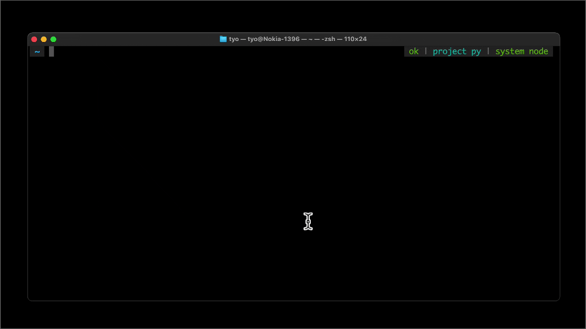
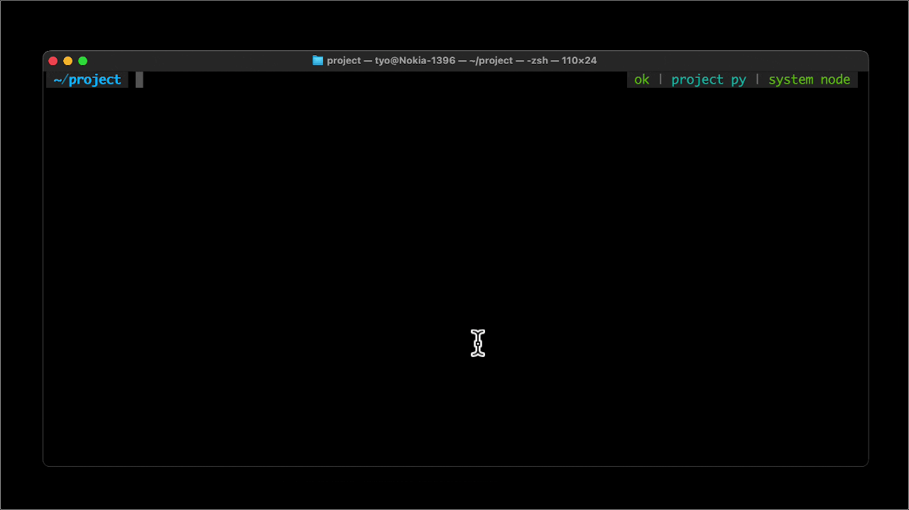
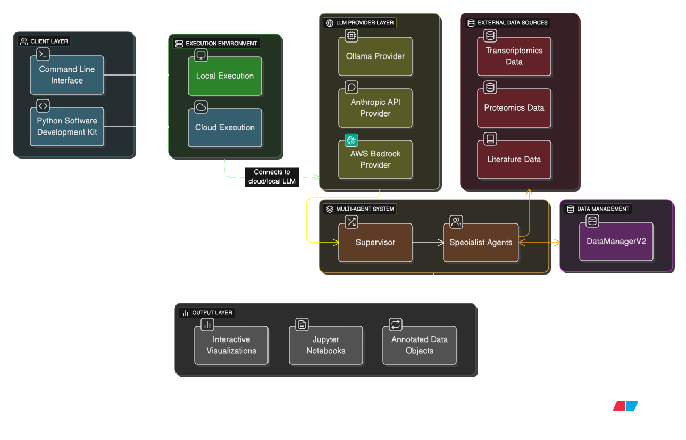

# 🦞 Lobster

[](https://www.gnu.org/licenses/agpl-3.0)
[](https://creativecommons.org/licenses/by/4.0/)
[](https://www.python.org/downloads/)
[](https://pypi.org/project/lobster-ai/)

**Bioinformatics co-pilot to automate redundant omics-related tasks so you can focus on science**

---

## 📋 Table of Contents

- [What is Lobster AI?](#-what-is-lobster-ai) - Overview and use cases
- [Quick Start](#-quick-start) - Install in 3 commands
- [LLM Providers](#-llm-providers) - Ollama, Anthropic, AWS Bedrock, Google Gemini
- [Features](#-features) - Single-cell, bulk RNA-seq, proteomics, visualization
- [Case Studies](#-case-studies) - Real-world examples
- [Roadmap](#-roadmap) - 2026 development plans
- [Use with Claude Code](#-use-with-claude-code) - IDE integration
- [Documentation](#-documentation) - Wiki and guides
- [Community & Support](#-community--support) - Get help
- [License](#-license) - AGPL-3.0-or-later

---

## ✨ What is Lobster AI?

Lobster AI combines specialized AI agents with open-source bioinformatics tools to analyze multi-omics data through natural language. Describe your analysis needs - no coding required.

**Perfect for:**
- 🧬 Bioinformatics researchers analyzing RNA-seq data
- 💻 Computational biologists seeking intelligent workflows
- 🔬 Life science teams needing reproducible results
- 📚 Students learning modern bioinformatics

---

## ⚡ Quick Start

```bash
# Install Lobster globally
uv pip install lobster-ai

# Configure (interactive wizard)
lobster init

# Start analyzing
lobster chat
```

**Don't have uv?** Install it: [macOS/Linux](https://astral.sh/uv/install.sh) | [Windows](https://astral.sh/uv/install.ps1)

**Alternative installation methods:** See [Complete Installation Guide](README_FULL.md#installation-methods) or [Wiki](https://github.com/the-omics-os/lobster-local/wiki/02-installation)

---

### 📺 Getting Started

<table>
<tr>
<td width="50%">

<p align="center"><strong>1️⃣ Install in 30 seconds</strong><br/><code>uv pip install lobster-ai</code></p>
</td>
<td width="50%">

<p align="center"><strong>2️⃣ Configure in 1 minute</strong><br/><code>lobster init</code></p>
</td>
</tr>
</table>

<div align="center">

<p><strong>3️⃣ Start analyzing with natural language</strong></p>
</div>

---

## 🏗️ Architecture Overview

Lobster is a **modular bioinformatics platform** with pluggable execution environments, LLM providers, and integrated data management:

<div align="center">

</div>

### Component Matrix

| Layer | Component | Configuration | Use Case |
|-------|-----------|---------------|----------|
| **Execution** | Local | Default (no setup) | Privacy-first, offline, cost-sensitive |
| | Cloud | `LOBSTER_CLOUD_KEY` | Team collaboration, scaling, managed infrastructure |
| **LLM Provider** | Ollama | `ollama pull gpt-oss:20b` | Local-only, unlimited usage, offline |
| | Anthropic | `ANTHROPIC_API_KEY` | Best quality, quick start, cloud/local |
| | AWS Bedrock | AWS credentials | Enterprise, compliance, high throughput |
| | Google Gemini | `GOOGLE_API_KEY` | Long context, multimodal, free tier available |
| **Data Sources** | GEO/SRA/ENA | Auto-configured | Transcriptomics datasets |
| | PRIDE/MassIVE | Auto-configured | Proteomics datasets |
| | PubMed/PMC | `NCBI_API_KEY` (optional) | Literature mining, metadata extraction |
| **Data Management** | DataManagerV2 | Auto-configured | Multi-modal data orchestration, provenance tracking |

### Configuration & Deployment

Lobster supports four deployment patterns optimized for different use cases:

| Pattern | Best For | Key Features |
|---------|----------|--------------|
| **Local + Ollama** | Privacy, learning, zero cost | Offline, unlimited usage, 100% local |
| **Local + Anthropic** | Quality, development | Best accuracy, quick setup, flexible |
| **Local + Gemini** | Cost optimization, free tier | Long context, multimodal, free tier available |
| **Cloud + Bedrock** | Production, teams | Enterprise SLA, high limits, scalable |

**Learn more:**
- 📖 [Deployment Patterns Guide](https://github.com/the-omics-os/lobster-local/wiki/03-configuration#deployment-patterns) - Detailed setup for each pattern
- 🔄 [Provider Auto-Detection](https://github.com/the-omics-os/lobster-local/wiki/03-configuration#provider-auto-detection) - How Lobster selects providers
- ⚙️ [Complete Configuration Guide](https://github.com/the-omics-os/lobster-local/wiki/03-configuration) - All configuration options

---

## 🧬 Features

| Category | Capabilities | Docs | Status |
|----------|--------------|------|--------|
| 🧬 **Single-Cell RNA-seq** | QC, Clustering, Annotation, Markers, Trajectories | [Tutorial](https://github.com/the-omics-os/lobster-local/wiki/23-tutorial-single-cell) | ✅ Available |
| 📊 **Bulk RNA-seq** | Differential expression, Complex designs, Formula-based stats | [Tutorial](https://github.com/the-omics-os/lobster-local/wiki/24-tutorial-bulk-rnaseq) | ✅ Available |
| 📚 **Literature Mining** | PubMed search, Full-text retrieval, Methods extraction | [Guide](https://github.com/the-omics-os/lobster-local/wiki/37-publication-intelligence-deep-dive) | ✅ Available |
| 🗄️ **Dataset Discovery** | GEO, SRA, PRIDE, ENA search and validation | [Guide](https://github.com/the-omics-os/lobster-local/wiki/47-geo-download-improvements-2024-11) | ✅ Available |
| 📈 **Visualization** | UMAP, Volcano plots, Heatmaps, Interactive figures | [Examples](https://github.com/the-omics-os/lobster-local/wiki/27-examples-cookbook) | ✅ Available |
| 🧪 **Metadata Assistant** | Cross-dataset harmonization, ID mapping | [Guide](https://github.com/the-omics-os/lobster-local/wiki/47-microbiome-harmonization-workflow) | ⭐ Premium |
| 🔬 **Proteomics** | DDA/DIA workflows, Missing values, Normalization | [Tutorial](https://github.com/the-omics-os/lobster-local/wiki/25-tutorial-proteomics) | ⭐ Premium |

[Full documentation →](https://github.com/the-omics-os/lobster-local/wiki)

---

### 📊 Interactive Dashboard (Alpha)

<div align="center">

<p><em>Real-time analysis monitoring with live updates and visualization</em></p>
</div>

Dashboard for deep-diving into omics anlaysis. 
```bash
#start with 
lobster dashboard
#or during CLI session with
❯ /dashboard
```

---

## 📘 Case Studies

### 🧬 Single-Cell Analysis
Download → QC → Cluster → Annotate in one conversation

```bash
❯ Download GSE109564, perform QC, cluster cells, and find markers

✓ Downloaded 5,000 cells × 20,000 genes
✓ Quality control: filtered to 4,477 high-quality cells
✓ Identified 12 distinct clusters
✓ Generated UMAP visualization with marker genes
```

### 📚 Literature Mining
Find papers, extract methods, discover datasets

```bash
❯ Find papers about CRISPR screens in cancer and extract their GEO datasets

Found 47 papers with 23 associated GEO datasets
Extracted methods from 12 papers with full-text access
Cached metadata for all datasets in workspace
```

### 📈 Visualization
Publication-ready figures with natural language

```bash
❯ Create a UMAP colored by cell type with cluster labels

Generated interactive UMAP visualization
Saved as: geo_gse109564_umap_celltype.html
Also exported as PNG for publications
```

[More examples in our cookbook →](https://github.com/the-omics-os/lobster-local/wiki/27-examples-cookbook)

---

## 🗓️ Roadmap

**2026 Development:**
- [ ] Custom feature agent (bring your tools/best practices)
- [ ] Knowledge graph integration for multi-dataset analysis
- [ ] Lobster Cloud compute infrastructure
- [ ] Enhanced multi-omics workflows (MuData integration)
- [ ] Community-contributed agent marketplace

**Submit feature ideas:** [GitHub Discussions](https://github.com/the-omics-os/lobster-local/discussions)

---

## 🔧 Use with Claude Code

Lobster integrates with [Claude Code](https://claude.com/claude-code) as an Agent Skill, allowing you to run bioinformatics analyses directly from your development environment.

### Quick Setup

```bash
# 1. Install Lobster
uv pip install lobster-ai
lobster init

# 2. Install Lobster Skill for Claude Code
curl -fsSL https://raw.githubusercontent.com/the-omics-os/lobster-local/main/claude-skill/SKILL.md \
  -o ~/.claude/skills/lobster/SKILL.md --create-dirs

# 3. Start Claude Code
claude
```

### Usage Examples

Claude Code will automatically invoke Lobster when you mention bioinformatics tasks:

```bash
# In Claude Code, just ask naturally:
You: "Analyze the single-cell dataset in data/counts.h5ad"
Claude: I'll use Lobster to analyze this single-cell dataset...
        [Invokes: lobster query "analyze data/counts.h5ad..."]

You: "Download GSE109564 and run quality control"
Claude: I'll use Lobster to download and analyze this dataset...
        [Invokes: lobster query "download GSE109564 and run QC"]

You: "Find papers about CRISPR screens in cancer"
Claude: I'll use Lobster to search the literature...
        [Invokes: lobster query "search pubmed for CRISPR screens cancer"]
```

**What this enables:**
- 🧬 Run bioinformatics analyses without leaving your IDE
- 📊 Extract data and generate reports programmatically
- 🔄 Combine Lobster with your development workflow
- 🤖 Let Claude handle the complexity of bioinformatics commands

[Learn more about Agent Skills →](https://docs.claude.com/en/docs/agents-and-tools/agent-skills)

---

## 📚 Documentation

| Resource | Description |
|----------|-------------|
| [Getting Started](https://github.com/the-omics-os/lobster-local/wiki/01-getting-started) | First-time user guide |
| [Installation](https://github.com/the-omics-os/lobster-local/wiki/02-installation) | Detailed installation options |
| [Configuration](https://github.com/the-omics-os/lobster-local/wiki/03-configuration) | LLM providers, API keys, settings |
| [CLI Commands](https://github.com/the-omics-os/lobster-local/wiki/05-cli-commands) | Interactive command reference |
| [Examples Cookbook](https://github.com/the-omics-os/lobster-local/wiki/27-examples-cookbook) | Real-world analysis recipes |
| [Troubleshooting](https://github.com/the-omics-os/lobster-local/wiki/28-troubleshooting) | Common issues and solutions |
| [FAQ](https://github.com/the-omics-os/lobster-local/wiki/29-faq) | Frequently asked questions |

**Full reference:** [README_FULL.md](README_FULL.md) | [Wiki Home](https://github.com/the-omics-os/lobster-local/wiki)

---

## 🤝 Community & Support

- **💬 Discussions**: [GitHub Discussions](https://github.com/the-omics-os/lobster-local/discussions)
- **🐛 Bug Reports**: [GitHub Issues](https://github.com/the-omics-os/lobster-local/issues)
- **📧 Email**: [info@omics-os.com](mailto:info@omics-os.com)
- **🌐 Website**: [omics-os.com](https://omics-os.com)
- **⭐ Premium**: [info@omics-os.com](mailto:info@omics-os.com) for pricing

**Contributing**: We welcome contributions! See [CONTRIBUTING.md](CONTRIBUTING.md) for guidelines.

---

## 📄 License

Lobster AI is open source under **[AGPL-3.0-or-later](LICENSE)**.

This license ensures all users receive the freedoms to use, study, share, and modify the software. Documentation is licensed **CC-BY-4.0**.

**Commercial licensing:** Contact [info@omics-os.com](mailto:info@omics-os.com)

---

<div align="center">

**Transform Your Bioinformatics Research Today**

`uv pip install lobster-ai && lobster chat`

*Made with sleep deprivation ☕️ by [Omics-OS](https://omics-os.com)*

</div>
