# 🦞 Lobster AI

[](https://opensource.org/licenses/MIT)
[](https://www.python.org/downloads/)

**Multi-Omics Multi-Agent Bioinformatics Analysis System powered by LangGraph**

Lobster AI is a powerful bioinformatics platform that uses specialized AI agents to analyze multi-omics data including transcriptomics and proteomics. Built on a modular architecture, it combines state-of-the-art language models with proven bioinformatics tools to provide intelligent, reproducible analyses.

## 🚀 Features

### Core Capabilities
- **🤖 Multi-Agent System**: Specialized agents for data management, research literature discovery, computational method extraction, transcriptomics, and proteomics
- **🔧 Centralized Agent Registry**: Single-source configuration for adding and managing agents system-wide
- **🧬 Multi-Omics Support**: Integrated analysis of transcriptomics and proteomics data
- **🏗️ Modular Architecture**: DataManagerV2 with extensible adapters and backends
- **📊 MuData Integration**: Professional multi-modal data analysis and visualization
- **☁️ Cloud-Ready**: S3-ready design for scalable cloud deployment

### Data Management
- **GEO Integration**: Download and analyze datasets from Gene Expression Omnibus
- **Format Support**: CSV, TSV, Excel, H5AD, 10X MTX, and more
- **Schema Validation**: Flexible validation with warnings (not failures) for exploratory analysis
- **Provenance Tracking**: Complete W3C-PROV-like audit trail for reproducibility

### Analysis Capabilities
- **Single-Cell RNA-seq**: Quality control, filtering, normalization, clustering, marker genes
- **Bulk RNA-seq**: Differential expression, pathway analysis, batch correction
- **Proteomics**: Mass spectrometry and affinity data, missing value handling, peptide mapping
- **Literature Mining**: PubMed integration for method parameters and validation
- **Multi-Modal Integration**: Cross-omics analysis using MuData framework

## 📦 Installation

### Quick Install (Recommended)

```bash
git clone https://github.com/homara-ai/lobster-ai.git
cd lobster
make install
```

This will:
- ✅ Check Python 3.12+ is installed
- ✅ Create isolated virtual environment
- ✅ Install all dependencies
- ✅ Set up environment configuration
- ✅ Provide clear next steps

# Command Line Interface

## 🎯 Quick Start

### Interactive Chat Mode

```bash
lobster chat
```

### Key Commands

### 🦞 Lobster CLI Commands

| Command            | Description                                 |
|--------------------|---------------------------------------------|
| `/help`            | Show help message with all commands         |
| `/status`          | Show system status                          |
| `/files`           | List workspace files                        |
| `/data`            | Show current data summary                   |
| `/plots`           | List generated plots                        |
| `/save`            | Save current state to workspace             |
| `/read <file>`     | Read a file from workspace                  |
| `/export`          | Export session data                         |
| `/reset`           | Reset conversation                          |
| `/mode <name>`     | Change operation mode                       |
| `/modes`           | List available modes                        |
| `/clear`           | Clear screen                                |
| `/exit`            | Exit the chat                               |

### Enhanced File Reading

The `/read` command now supports:
- Reading files from subdirectories (`/read data.csv` finds files in `.lobster_workspace/data/`)
- Absolute paths (`/read /Users/name/Desktop/file.csv`)
- Case-insensitive matching
- Detailed debug logging

## 🔧 Configuration

### Quick Setup

```bash
Read config/README_CONFIGURATION.md
```

In short: 
1. Populate .env file
This interactive command will help you set up:
- API keys (OpenAI, AWS Bedrock, NCBI)
- Model preferences
- Default settings

### Manual Setup

Create a `.env` file in your working directory:

```env
# Required
OPENAI_API_KEY=your-openai-key
AWS_BEDROCK_ACCESS_KEY=your-aws-key
AWS_BEDROCK_SECRET_ACCESS_KEY=your-aws-secret

# Optional
NCBI_API_KEY=your-ncbi-key
GENIE_PROFILE=production
```

### Interactive Chat Mode for debugging

```bash
lobster chat --reasoning --debug
```

### Single Query

```bash
lobster query "Download and analyze GSE109564 from GEO"
```

### With Custom Workspace

```bash
lobster chat --workspace ./my-analysis
```

# Streamlit

## local run
```bash
streamlit run lobster/streamlit_app.py
```

### Using Docker

```bash
docker build -f Dockerfile -t lobster-ai:py313 .
docker run -p 8501:8501 --env-file .env lobster-ai:py313
```

## 🏗️ Modular DataManagerV2 Architecture

Lobster AI now features a **modular, extensible architecture** that supports multi-omics analysis through specialized adapters and storage backends.

### Architecture Overview

```mermaid
graph TB
    subgraph "AI Agents"
        DE[Data Expert<br/>🔄 Multi-Omics Data Management]
        RA[Research Agent<br/>🔍 Literature Discovery & Dataset ID]
        ME[Method Expert<br/>⚙️ Computational Parameter Extraction]
        TE[Transcriptomics Expert<br/>🧬 RNA-seq Analysis]  
        PE[Proteomics Expert<br/>🧪 Protein Analysis]
    end

    subgraph "Publication Services"
        PS[Publication Service<br/>🎯 Multi-Provider Orchestrator]
        PP[PubMed Provider<br/>📚 Literature Search]
        GP[GEO Provider<br/>🧬 Direct Dataset Search]
    end

    subgraph "DataManagerV2"
        DM2[Central Orchestrator<br/>🎯 Modality Management]
        MODS[Loaded Modalities<br/>📊 In-Memory Storage]
    end

    subgraph "Modality Adapters"
        TRA[TranscriptomicsAdapter<br/>Single-cell & Bulk RNA-seq]
        PRA[ProteomicsAdapter<br/>MS & Affinity Proteomics]
    end

    subgraph "Storage Backends"
        H5BE[H5AD Backend<br/>💾 AnnData Storage]
        MUBE[MuData Backend<br/>🔗 Multi-Modal Storage]
    end

    DE --> DM2
    RA --> PS
    RA --> DM2
    ME --> PS
    ME --> DM2
    TE --> DM2
    PE --> DM2
    
    PS --> PP
    PS --> GP
    
    DM2 --> TRA
    DM2 --> PRA
    DM2 --> MODS
    
    MODS --> H5BE
    MODS --> MUBE

    classDef agent fill:#e1f5fe,stroke:#01579b,stroke-width:2px
    classDef orchestrator fill:#f3e5f5,stroke:#4a148c,stroke-width:3px
    classDef service fill:#e8f5e8,stroke:#2e7d32,stroke-width:2px
    classDef adapter fill:#e8f5e8,stroke:#1b5e20,stroke-width:2px
    classDef backend fill:#fff3e0,stroke:#e65100,stroke-width:2px

    class DE,RA,ME,TE,PE agent
    class DM2,MODS orchestrator
    class PS,PP,GP service
    class TRA,PRA adapter
    class H5BE,MUBE backend
```




### Key Components

#### 🎯 **DataManagerV2** - Central Orchestrator
- **Modality Management**: Load, store, and manage multiple data modalities
- **Schema Validation**: Flexible validation with warnings for exploratory analysis
- **Provenance Tracking**: Complete audit trail for reproducible research
- **Multi-Modal Integration**: MuData support for integrated omics analysis

#### 🔌 **Modality Adapters**
- **TranscriptomicsAdapter**: Single-cell and bulk RNA-seq with automatic gene flagging
- **ProteomicsAdapter**: Mass spectrometry and affinity data with missing value handling
- **Extensible**: Easy to add new modalities (metabolomics, imaging, etc.)

#### 💾 **Storage Backends** 
- **H5ADBackend**: AnnData storage with S3-ready path handling
- **MuDataBackend**: Multi-modal data storage for integrated analysis
- **Cloud-Ready**: Designed for seamless S3 integration

## 💬 Multi-Omics Example Usage

### Single-Cell RNA-seq Analysis
```bash
🦞 You: Download GSE109564 and perform single-cell analysis

🦞 Lobster: I'll download and analyze the single-cell dataset...

[Data Expert Agent]
✓ Downloaded GSE109564 as modality 'geo_gse109564'
✓ Loaded: 5,000 cells × 20,000 genes using transcriptomics_single_cell adapter
✓ Schema validation: 2 warnings, no errors

[Transcriptomics Expert Agent]  
✓ Quality assessment: Mean 3,500 genes/cell, 8.2% mitochondrial
✓ Filtered modality: 4,477 cells × 18,543 genes (removed low-quality data)
✓ Clustered modality: 12 clusters identified using Leiden algorithm
✓ Marker genes: Found distinctive markers for each cluster

[Visualizations created:]
- Quality control metrics
- UMAP clustering plot  
- Marker gene heatmap

Analysis complete! The dataset shows 12 distinct cell populations.
```

### Multi-Omics Integrated Analysis
```bash
🦞 You: Load transcriptomics data GSE12345 and proteomics data proteins.csv, then perform integrated analysis

🦞 Lobster: I'll set up multi-omics analysis with both datasets...

[Data Expert Agent]
✓ Loaded transcriptomics: 'geo_gse12345' (3,200 cells × 15,000 genes)
✓ Loaded proteomics: 'ms_proteins' (3,200 cells × 1,247 proteins) 
✓ Created MuData: integrated_analysis.h5mu

[Multi-Modal Analysis]
✓ Cross-modal correlation analysis
✓ Integrated dimensionality reduction
✓ Multi-omics clustering with 8 joint clusters
✓ Protein-RNA correlation networks

The integrated analysis reveals 8 multi-omics cell states with distinct protein-RNA signatures.
```

## 🧬 Specialized Analysis Capabilities

### 🧬 **Transcriptomics** (Single-cell & Bulk)
- **Quality Control**: Automated filtering with literature-based thresholds
- **Preprocessing**: Normalization, scaling, highly variable gene selection
- **Clustering**: Leiden/Louvain algorithms with resolution optimization
- **Cell Annotation**: Marker-based and reference atlas approaches
- **Differential Expression**: Between clusters, conditions, or time points
- **Integration**: Batch correction and dataset integration methods

### 🧪 **Proteomics** (Mass Spec & Affinity)
- **Missing Value Handling**: Multiple imputation strategies for sparse proteomics data
- **Quality Control**: Contaminant detection, reverse hit removal, CV filtering
- **Normalization**: Median, quantile, and total sum normalization methods
- **Peptide Mapping**: Integration of peptide-to-protein relationships for MS data
- **Statistical Analysis**: Differential protein expression with multiple testing correction
- **Pattern Analysis**: PCA, clustering, and correlation analysis

### 📚 **Literature Discovery & Research Integration**
- **Research Agent**: Specialized agent for comprehensive literature discovery and dataset identification
- **Direct GEO Search**: Search NCBI's GEO DataSets database directly with advanced filtering
- **PubMed Integration**: Advanced literature search with publication metadata extraction
- **Dataset Discovery**: Filter by organism, platform, date ranges, and file types
- **Method Agent Coordination**: Seamless handoff for computational parameter extraction
- **Multi-Source Integration**: PubMed literature + direct GEO database access + bioRxiv/medRxiv support

### 🔬 **Computational Method Extraction**
- **Parameter Optimization**: Method-specific parameter recommendations from literature
- **Protocol Analysis**: Extract computational methods and parameters from publications
- **Validation**: Cross-reference results with published studies
- **Methodology Comparison**: Comparative analysis across multiple studies and approaches

## 🔄 Migration from Legacy System

The system maintains backward compatibility while providing enhanced capabilities:

### Legacy Usage (Still Supported)
```python
from lobster.core.data_manager import DataManager
dm = DataManager()
dm.set_data(dataframe)
```

### New Modular Usage (Recommended)
```python
from lobster.core.data_manager_v2 import DataManagerV2
dm = DataManagerV2()

# Load multiple modalities
dm.load_modality("rna_seq", "data.csv", "transcriptomics_single_cell")
dm.load_modality("proteins", "proteins.csv", "proteomics_ms")

# Integrated analysis
mudata = dm.to_mudata()
dm.save_mudata("integrated_study.h5mu")
```

## 🎯 Available Data Adapters

| Adapter | Data Type | Supported Formats | Key Features |
|---------|-----------|-------------------|--------------|
| `transcriptomics_single_cell` | Single-cell RNA-seq | CSV, TSV, Excel, H5AD, MTX | Mitochondrial flagging, doublet detection |
| `transcriptomics_bulk` | Bulk RNA-seq | CSV, TSV, Excel, H5AD | Batch effect handling, DE analysis |
| `proteomics_ms` | Mass Spectrometry | CSV, TSV, Excel | Missing value strategies, contaminant removal |
| `proteomics_affinity` | Antibody Arrays | CSV, TSV, Excel | Signal-to-background analysis |

## 📊 Export & Reproducibility

This creates a ZIP file containing:
- Raw and processed data
- All generated plots (interactive HTML + static PNG)
- Complete methodology report
- Tool parameters and timestamps

## 🛠️ Advanced Usage

### Using Different Models

```bash
# Use Claude for complex analyses
export GENIE_PROFILE=high-performance
lobster chat

# Use lightweight models for quick tasks
export GENIE_PROFILE=cost-optimized
lobster chat
```

### Programmatic Usage

```python
from lobster import LobsterClient

client = LobsterClient()
result = client.query("Analyze my single-cell data for T cell markers")
print(result['response'])
```

## Deploy Streamlit to AWS fargate via CDK

Taken from [aws-examples repo](https://github.com/aws-samples/deploy-streamlit-app)

```bash
cdk bootstrap
cdk deploy
```

The deployment takes 5 to 10 minutes.

Make a note of the output, in which you will find the CloudFront distribution URL
and the Cognito user pool id.

4. Create a user in the Cognito UserPool that has been created. You can perform this action from your AWS Console. 
5. From your browser, connect to the CloudFront distribution url.
6. Log in to the Streamlit app with the user you have created in Cognito.

## Some limitations

* The connection between CloudFront and the ALB is in HTTP, not SSL encrypted.
This means traffic between CloudFront and the ALB is unencrypted.
It is **strongly recommended** to configure HTTPS by bringing your own domain name and SSL/TLS certificate to the ALB.

## � Contributing

We welcome contributions! Please see our [Contributing Guide](CONTRIBUTING.md) for details.

```bash
# Setup development environment
make dev-install

# Run tests
make test

# Format code
make format
```

## 📄 License

This project is licensed under the MIT License - see the [LICENSE](LICENSE) file for details.

## 🙏 Acknowledgments

- Built with [LangGraph](https://github.com/langchain-ai/langgraph) and [LangChain](https://github.com/langchain-ai/langchain)
- Bioinformatics tools: [Scanpy](https://scanpy.readthedocs.io/), [BioPython](https://biopython.org/)
- Created by [Homara AI](https://homara.ai)

## 📞 Support

- 📧 Email: support@homara.ai
- 💬 Discord: [Join our community](https://discord.gg/homaraai)
- 🐛 Issues: [GitHub Issues](https://github.com/homara-ai/lobster-ai/issues)

---

<p align="center">
  Made with ❤️ by <a href="https://homara.ai">Homara AI</a>
</p>
