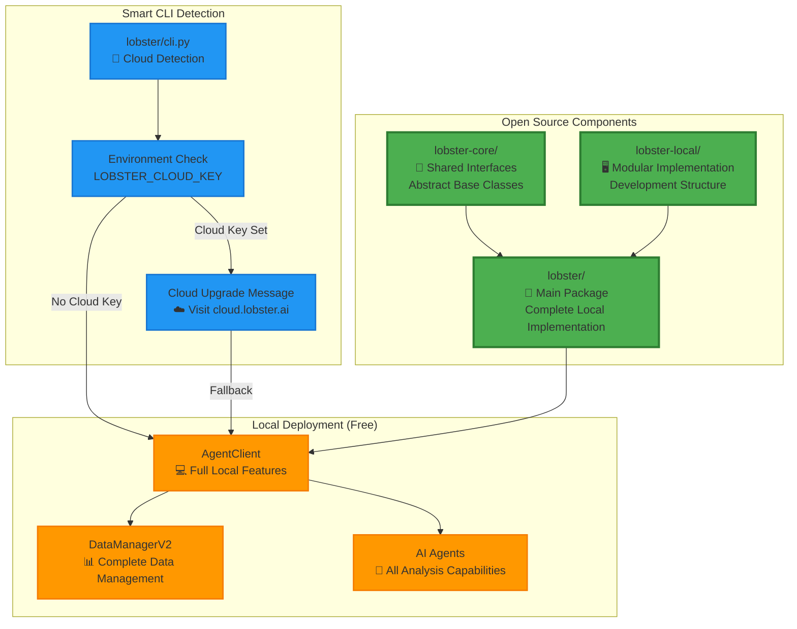
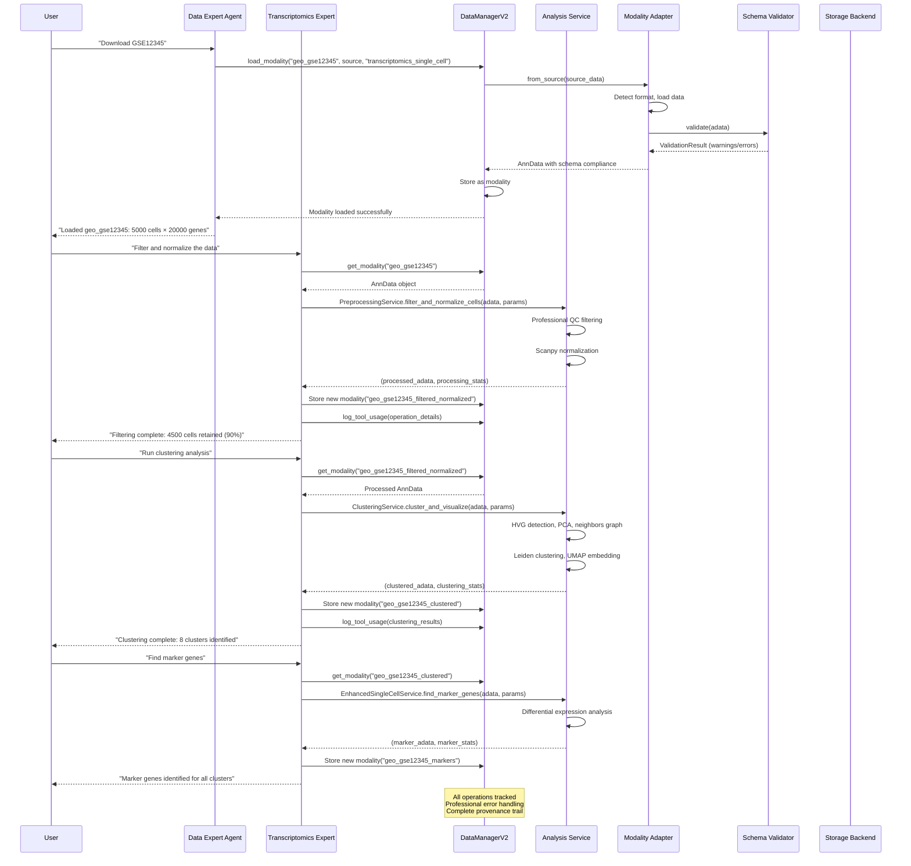
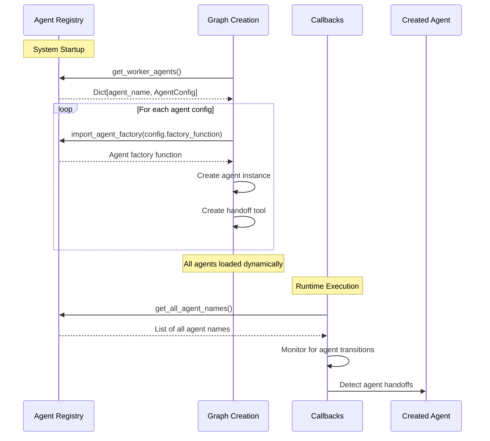

# Lobster AI - Open Source Architecture

## 🏗️ **System Architecture Overview**

Lobster AI is a powerful **multi-agent bioinformatics platform** designed for both local and cloud deployment. This documentation covers the open source components available in this repository.

### 📦 **Open Source Package Structure**



### 🌟 **Cloud Platform (Coming Soon)**


## System Architecture Overview - Post Migration

```mermaid
graph TB
    %% Data Sources
    subgraph "Data Sources"
        GEO[GEO Database<br/>GSE Datasets]
        CSV[CSV Files<br/>Local Data]
        EXCEL[Excel Files<br/>Lab Data]
        H5AD[H5AD Files<br/>Processed Data]
        MTX[10X MTX<br/>Single-cell Data]
    end

    %% NEW: Agent Registry System
    subgraph "Agent Registry System"
        AREG[Agent Registry<br/>🏛️ Single Source of Truth]
        ACONF[Agent Configurations<br/>📋 Factory Functions & Metadata]
        HDTOOLS[Handoff Tools<br/>🔄 Dynamic Tool Generation]
    end

    %% Agents Layer
    subgraph "AI Agents - Dynamically Loaded"
        DE[Data Expert<br/>🔄 Data Loading & Management]
        RA[Research Agent<br/>🔍 Literature Discovery & Dataset ID]
        ME[Method Expert<br/>⚙️ Computational Parameter Extraction]
        TE[Transcriptomics Expert<br/>🧬 RNA-seq Analysis]
        PE[Proteomics Expert<br/>🧪 Protein Analysis]
    end

    %% NEW: Analysis Services Layer (Stateless)
    subgraph "Analysis Services - Stateless & Modular"
        PREP[PreprocessingService<br/>🔧 Filter & Normalize]
        QUAL[QualityService<br/>📊 QC Assessment]
        CLUST[ClusteringService<br/>🎯 Leiden & UMAP]
        SCELL[EnhancedSingleCellService<br/>🔬 Doublets & Annotation]
        BULK[BulkRNASeqService<br/>📈 Bulk Analysis]
        GEO_SVC[GEOService<br/>💾 Data Download]
    end
    
    %% NEW: Publication Services Layer
    subgraph "Publication & Literature Services"
        PUBSVC[PublicationService<br/>🎯 Multi-Provider Orchestrator]
        PUBMED[PubMedProvider<br/>📚 Literature Search]
        GEOPROV[GEOProvider<br/>🧬 Direct GEO DataSets Search]
        GEOQB[GEOQueryBuilder<br/>🔍 Advanced Query Construction]
    end

    %% DataManagerV2 Orchestration
    subgraph "DataManagerV2 Orchestration"
        DM2[DataManagerV2<br/>🎯 Modality Coordinator]
        MODALITIES[Modality Storage<br/>📊 AnnData Objects]
        PROV[Provenance Tracker<br/>📋 Analysis History]
        ERROR[Error Handling<br/>⚠️ Professional Exceptions]
    end

    %% Modality Adapters
    subgraph "Modality Adapters"
        TRA[TranscriptomicsAdapter<br/>🧬 RNA-seq Loading]
        PRA[ProteomicsAdapter<br/>🧪 Protein Loading]
        
        subgraph "Transcriptomics Types"
            TRSC[Single-cell RNA-seq<br/>Schema & Validation]
            TRBL[Bulk RNA-seq<br/>Schema & Validation]
        end
        
        subgraph "Proteomics Types"
            PRMS[Mass Spectrometry<br/>Missing Value Handling]
            PRAF[Affinity Proteomics<br/>Antibody Arrays]
        end
        
        TRA --> TRSC
        TRA --> TRBL
        PRA --> PRMS
        PRA --> PRAF
    end

    %% Storage Backends
    subgraph "Storage Backends"
        H5BE[H5ADBackend<br/>💾 Single Modality<br/>S3-Ready]
        MUBE[MuDataBackend<br/>🔗 Multi-Modal<br/>Integrated Analysis]
    end

    %% Schema & Validation
    subgraph "Schema System"
        TSCH[TranscriptomicsSchema<br/>📋 RNA-seq Rules]
        PSCH[ProteomicsSchema<br/>📋 Protein Rules]
        FVAL[FlexibleValidator<br/>⚠️ Warning-based QC]
    end

    %% Interfaces
    subgraph "Core Interfaces"
        IBACK[IDataBackend<br/>🔌 Storage Contract]
        IADAP[IModalityAdapter<br/>🔌 Processing Contract]
        IVAL[IValidator<br/>🔌 Validation Contract]
    end

    %% Data Flow Connections
    GEO --> DE
    CSV --> DE  
    EXCEL --> DE
    H5AD --> DE
    MTX --> DE

    %% NEW: Agent to Service connections
    DE --> GEO_SVC
    RA --> PUBSVC
    RA --> GEOPROV
    ME --> PUBSVC
    TE --> PREP
    TE --> QUAL
    TE --> CLUST
    TE --> SCELL
    PE --> PREP
    PE --> QUAL

    %% Service to DataManager connections
    PREP --> |AnnData Processing| DM2
    QUAL --> |QC Metrics| DM2
    CLUST --> |Clustering Results| DM2
    SCELL --> |Annotations| DM2
    GEO_SVC --> |Dataset Loading| DM2
    PUBSVC --> |Publication Metadata| DM2

    %% DataManager orchestration
    DM2 --> TRA
    DM2 --> PRA
    DM2 --> MODALITIES
    DM2 --> PROV
    DM2 --> ERROR

    TRA --> TSCH
    PRA --> PSCH
    TSCH --> FVAL
    PSCH --> FVAL

    MODALITIES --> H5BE
    MODALITIES --> MUBE

    %% Interface implementations
    TRA -.-> IADAP
    PRA -.-> IADAP
    H5BE -.-> IBACK
    MUBE -.-> IBACK
    FVAL -.-> IVAL

    %% Styling
    classDef agent fill:#e1f5fe,stroke:#01579b,stroke-width:2px
    classDef service fill:#e8f5e8,stroke:#2e7d32,stroke-width:2px
    classDef orchestrator fill:#f3e5f5,stroke:#4a148c,stroke-width:3px
    classDef adapter fill:#fff3e0,stroke:#f57c00,stroke-width:2px
    classDef backend fill:#fce4ec,stroke:#c2185b,stroke-width:2px
    classDef schema fill:#f1f8e9,stroke:#388e3c,stroke-width:2px
    classDef interface fill:#f3e5f5,stroke:#7b1fa2,stroke-width:2px,stroke-dasharray: 5 5
    classDef source fill:#f5f5f5,stroke:#616161,stroke-width:1px

    class DE,RA,ME,TE,PE agent
    class PREP,QUAL,CLUST,SCELL,BULK,PUBSVC,PUBMED,GEOPROV,GEOQB service
    class DM2,MODALITIES,PROV,ERROR orchestrator
    class TRA,PRA,TRSC,TRBL,PRMS,PRAF adapter
    class H5BE,MUBE backend
    class TSCH,PSCH,FVAL schema
    class IBACK,IADAP,IVAL interface
    class GEO,CSV,EXCEL,H5AD,MTX source
```



## Data Flow Diagram - Modular Service Architecture



## Component Interaction Matrix

```mermaid
graph LR
    subgraph "Agents → DataManagerV2"
        DE[Data Expert] --> |load_modality<br/>save_modality| DM2[DataManagerV2]
        TE[Transcriptomics Expert] --> |get_modality<br/>process_data| DM2
        PE[Proteomics Expert] --> |get_modality<br/>analyze_patterns| DM2
        ME[Method Expert] --> |parameter_guidance| DM2
    end

    subgraph "DataManagerV2 → Adapters"
        DM2 --> |from_source| TRA[TranscriptomicsAdapter]
        DM2 --> |from_source| PRA[ProteomicsAdapter]
    end

    subgraph "Adapters → Validation"
        TRA --> |validate| TSCH[TranscriptomicsSchema]
        PRA --> |validate| PSCH[ProteomicsSchema]
        TSCH --> FVAL[FlexibleValidator]
        PSCH --> FVAL
    end

    subgraph "DataManagerV2 → Storage"
        DM2 --> |save/load| H5BE[H5ADBackend]
        DM2 --> |save/load| MUBE[MuDataBackend]
    end

    classDef agent fill:#e1f5fe,stroke:#01579b,stroke-width:2px
    classDef orchestrator fill:#f3e5f5,stroke:#4a148c,stroke-width:3px
    classDef adapter fill:#e8f5e8,stroke:#1b5e20,stroke-width:2px
    classDef backend fill:#fff3e0,stroke:#e65100,stroke-width:2px
    classDef schema fill:#fce4ec,stroke:#880e4f,stroke-width:2px

    class DE,TE,PE,ME agent
    class DM2 orchestrator
    class TRA,PRA adapter
    class H5BE,MUBE backend
    class TSCH,PSCH,FVAL schema

## 🏛️ Centralized Agent Registry System

### Overview

The Lobster AI system now features a **centralized agent registry** that serves as the single source of truth for all agent configurations. This eliminates redundancy and reduces errors when adding new agents to the system.

### Agent Registry Architecture

```mermaid
graph TB
    subgraph "Agent Registry System"
        AREG[Agent Registry<br/>lobster/config/agent_registry.py]
        ACONF[AgentConfig Objects<br/>🔧 Metadata & Factory Functions]
        HELPERS[Helper Functions<br/>🛠️ get_worker_agents()<br/>get_all_agent_names()]
    end

    subgraph "System Integration"
        GRAPH[Graph Creation<br/>lobster/agents/graph.py]
        CALLBACKS[Callback System<br/>lobster/utils/callbacks.py]
        SETTINGS[Settings Integration<br/>lobster/config/settings.py]
    end

    subgraph "Dynamic Loading"
        IMPORT[Dynamic Import<br/>import_agent_factory()]
        TOOLS[Tool Generation<br/>create_custom_handoff_tool()]
        DETECT[Agent Detection<br/>get_all_agent_names()]
    end

    AREG --> ACONF
    AREG --> HELPERS
    
    HELPERS --> GRAPH
    HELPERS --> CALLBACKS
    HELPERS --> SETTINGS
    
    ACONF --> IMPORT
    ACONF --> TOOLS
    HELPERS --> DETECT

    classDef registry fill:#e8f5e8,stroke:#2e7d32,stroke-width:3px
    classDef integration fill:#e1f5fe,stroke:#01579b,stroke-width:2px
    classDef dynamic fill:#fff3e0,stroke:#f57c00,stroke-width:2px

    class AREG,ACONF,HELPERS registry
    class GRAPH,CALLBACKS,SETTINGS integration
    class IMPORT,TOOLS,DETECT dynamic
```

### Agent Configuration Schema

Each agent in the registry is defined using an `AgentConfig` dataclass:

```python
@dataclass
class AgentConfig:
    """Configuration for an agent in the system."""
    name: str                              # Unique agent identifier
    display_name: str                     # Human-readable name
    description: str                      # Agent's purpose/capability
    factory_function: str                 # Module path to factory function
    handoff_tool_name: Optional[str]     # Name of handoff tool
    handoff_tool_description: Optional[str]  # Tool description
```

### Current Agent Registry

```python
AGENT_REGISTRY: Dict[str, AgentConfig] = {
    'data_expert_agent': AgentConfig(
        name='data_expert_agent',
        display_name='Data Expert',
        description='Handles data fetching and download tasks',
        factory_function='lobster.agents.data_expert.data_expert',
        handoff_tool_name='handoff_to_data_expert',
        handoff_tool_description='Assign data fetching/download tasks to the data expert'
    ),
    'singlecell_expert_agent': AgentConfig(
        name='singlecell_expert_agent',
        display_name='Single-Cell Expert',
        description='Handles single-cell RNA-seq analysis tasks',
        factory_function='lobster.agents.singlecell_expert.singlecell_expert',
        handoff_tool_name='handoff_to_singlecell_expert',
        handoff_tool_description='Assign single-cell RNA-seq analysis tasks to the single-cell expert'
    ),
    'bulk_rnaseq_expert_agent': AgentConfig(
        name='bulk_rnaseq_expert_agent',
        display_name='Bulk RNA-seq Expert',
        description='Handles bulk RNA-seq analysis tasks',
        factory_function='lobster.agents.bulk_rnaseq_expert.bulk_rnaseq_expert',
        handoff_tool_name='handoff_to_bulk_rnaseq_expert',
        handoff_tool_description='Assign bulk RNA-seq analysis tasks to the bulk RNA-seq expert'
    ),
    'research_agent': AgentConfig(
        name='research_agent',
        display_name='Research Agent',
        description='Handles literature discovery and dataset identification tasks',
        factory_function='lobster.agents.research_agent.research_agent',
        handoff_tool_name='handoff_to_research_agent',
        handoff_tool_description='Assign literature search and dataset discovery tasks to the research agent'
    ),
    'method_expert_agent': AgentConfig(
        name='method_expert_agent',
        display_name='Method Expert',
        description='Handles computational method extraction and parameter analysis from publications',
        factory_function='lobster.agents.method_expert.method_expert',
        handoff_tool_name='handoff_to_method_expert',
        handoff_tool_description='Assign computational parameter extraction tasks to the method expert'
    ),
}
```

### System Integration Flow



### Benefits of Centralized Registry

#### **Before (Legacy System)**
```
Adding new agents required updating:
├── lobster/agents/graph.py          # Import statements
├── lobster/agents/graph.py          # Agent creation code
├── lobster/agents/graph.py          # Handoff tool definitions
├── lobster/utils/callbacks.py       # Agent name hardcoded list
└── Multiple imports throughout codebase
```

#### **After (Registry System)**
```
Adding new agents only requires:
└── lobster/config/agent_registry.py  # Single registry entry

Everything else is handled automatically:
├── ✅ Dynamic agent loading
├── ✅ Automatic handoff tool creation
├── ✅ Callback system integration
├── ✅ Type-safe configuration
└── ✅ Professional error handling
```

### How to Add New Agents

#### **Step 1: Create Agent Implementation**
```python
# lobster/agents/new_agent.py
def new_agent(data_manager, callback_handler=None, agent_name='new_agent', handoff_tools=None):
    """Create a new specialized agent."""
    # Agent implementation
    return agent_instance
```

#### **Step 2: Register in Agent Registry**
```python
# lobster/config/agent_registry.py
AGENT_REGISTRY = {
    # ... existing agents ...
    'new_agent': AgentConfig(
        name='new_agent',
        display_name='New Agent',
        description='Handles specialized new functionality',
        factory_function='lobster.agents.new_agent.new_agent',
        handoff_tool_name='handoff_to_new_agent',
        handoff_tool_description='Assign specialized tasks to the new agent'
    ),
}
```

#### **Step 3: Done!**
The system automatically handles:
- ✅ Agent loading in graph creation
- ✅ Handoff tool generation
- ✅ Callback system detection
- ✅ Error handling and logging
- ✅ Integration with existing workflows

### Registry Helper Functions

The registry provides several utility functions:

```python
# Get all worker agents with configurations
worker_agents = get_worker_agents()
# Returns: Dict[str, AgentConfig]

# Get all agent names (including system agents)
all_agents = get_all_agent_names()
# Returns: List[str]

# Get specific agent configuration
config = get_agent_config('data_expert_agent')
# Returns: AgentConfig or None

# Dynamically import agent factory
factory = import_agent_factory('lobster.agents.data_expert.data_expert')
# Returns: Callable
```

### Error Prevention

The registry system prevents common errors:

#### **Runtime Validation**
- ✅ Factory function existence validation
- ✅ Import path verification
- ✅ Configuration completeness checks
- ✅ Duplicate agent name detection

#### **Development Safety**
- ✅ Type hints for all configurations
- ✅ Consistent naming conventions
- ✅ Comprehensive error messages
- ✅ Centralized documentation

#### **Maintenance Benefits**
- ✅ Single source of truth
- ✅ Easy to audit and review
- ✅ Reduced cognitive load
- ✅ Professional code organization

### Testing the Registry

The system includes comprehensive testing:

```python
# tests/test_agent_registry.py
def test_agent_registry():
    """Test the agent registry functionality."""
    # Test 1: Verify all agents are registered
    worker_agents = get_worker_agents()
    assert len(worker_agents) > 0
    
    # Test 2: Validate factory function imports
    for agent_name, config in worker_agents.items():
        factory = import_agent_factory(config.factory_function)
        assert callable(factory)
    
    # Test 3: Check agent name consistency
    all_agents = get_all_agent_names()
    assert 'supervisor' in all_agents
    assert 'data_expert_agent' in all_agents
```

Run the test with:
```bash
python tests/test_agent_registry.py
```

This centralized approach ensures professional, maintainable, and error-free agent management across the entire Lobster AI system.

## 🌟 **Open Source Benefits**

### 🆓 **What You Get for Free**
- **Complete Bioinformatics Platform**: All analysis capabilities included
- **AI-Powered Analysis**: Natural language interface to bioinformatics
- **Publication-Ready Outputs**: Professional visualizations and reports
- **Extensible Architecture**: Add custom analysis methods easily
- **Active Development**: Regular updates and community contributions

### 📈 **Why Choose Local Installation**
- **Privacy**: Your data never leaves your computer
- **Customization**: Full control over analysis parameters
- **Learning**: Study the source code to understand methods
- **Contribution**: Help improve the platform for everyone
- **Cost**: Completely free (you pay only for your own API keys)

### ☁️ **Interested in Cloud?**
For teams needing scalable infrastructure, managed services, or collaborative features, we're developing a cloud platform. 

**[Join the Waitlist →](mailto:cloud@homara.ai)**

## Architecture Migration Summary

### 🎯 Migration Goals Achieved

The Lobster AI system has been successfully migrated from a dual-system architecture (legacy DataManager + DataManagerV2) to a clean, professional, modular DataManagerV2-only implementation.

### ✅ Key Improvements

#### **1. Modular Service Architecture**
- **Before**: Agents contained mixed responsibilities with dual code paths
- **After**: Clean separation with stateless analysis services and orchestration agents

#### **2. Professional Error Handling**
- **Custom Exception Hierarchy**: 
  - `TranscriptomicsError`, `PreprocessingError`, `QualityError`, etc.
  - `ModalityNotFoundError` for specific validation
- **Comprehensive Logging**: All operations tracked with parameters and results
- **Graceful Error Recovery**: Informative error messages with suggested fixes

#### **3. Stateless Services Design**
- **PreprocessingService**: AnnData filtering, normalization, batch correction
- **QualityService**: Comprehensive QC assessment with statistical metrics
- **ClusteringService**: Leiden clustering, PCA, UMAP visualization
- **EnhancedSingleCellService**: Doublet detection, cell type annotation
- **GEOService**: Professional dataset downloading and processing
- **PubMedService**: Literature mining and method extraction

### 🏗️ New Architecture Pattern

#### **Agent Tool Pattern**
```python
@tool
def tool_name(modality_name: str, **params) -> str:
    """Professional tool with comprehensive error handling."""
    try:
        # 1. Validate modality exists
        if modality_name not in data_manager.list_modalities():
            raise ModalityNotFoundError(f"Modality '{modality_name}' not found")
        
        # 2. Get AnnData from modality
        adata = data_manager.get_modality(modality_name)
        
        # 3. Call stateless service
        result_adata, stats = service.method_name(adata, **params)
        
        # 4. Save new modality with descriptive name
        new_modality_name = f"{modality_name}_processed"
        data_manager.modalities[new_modality_name] = result_adata
        
        # 5. Log operation for provenance
        data_manager.log_tool_usage(tool_name, params, description)
        
        # 6. Format professional response
        return format_professional_response(stats, new_modality_name)
        
    except ServiceError as e:
        logger.error(f"Service error: {e}")
        return f"Service error: {str(e)}"
    except Exception as e:
        logger.error(f"Unexpected error: {e}")
        return f"Unexpected error: {str(e)}"
```

#### **Service Method Pattern**
```python
def service_method(
    self,
    adata: anndata.AnnData,
    **parameters
) -> Tuple[anndata.AnnData, Dict[str, Any]]:
    """
    Stateless service method working with AnnData directly.
    
    Returns:
        Tuple of (processed_adata, processing_statistics)
    """
    try:
        # 1. Create working copy
        adata_processed = adata.copy()
        
        # 2. Apply analysis algorithms
        # ... processing logic ...
        
        # 3. Calculate comprehensive statistics
        processing_stats = {
            "analysis_type": "method_type",
            "parameters_used": parameters,
            "results": {...}
        }
        
        return adata_processed, processing_stats
        
    except Exception as e:
        raise ServiceError(f"Method failed: {str(e)}")
```

### 📊 Modality Management System

#### **Descriptive Naming Convention**
Each analysis step creates new modalities with descriptive, traceable names:

```
geo_gse12345                    # Raw downloaded data
├── geo_gse12345_quality_assessed    # With QC metrics
├── geo_gse12345_filtered_normalized # Preprocessed data
├── geo_gse12345_doublets_detected   # With doublet annotations
├── geo_gse12345_clustered          # With clustering results
├── geo_gse12345_markers           # With marker genes
└── geo_gse12345_annotated        # With cell type annotations
```

#### **Professional Modality Tracking**
- **Provenance**: Complete analysis history with parameters
- **Statistics**: Comprehensive metrics for each processing step
- **Validation**: Schema enforcement and quality checks
- **Storage**: Automatic saving with professional file naming

### 🔬 Analysis Workflow Excellence

#### **Standard Single-cell RNA-seq Pipeline**
```
1. check_data_status() → Review available modalities
2. assess_data_quality(modality_name) → Professional QC assessment
3. filter_and_normalize_modality(...) → Clean and normalize
4. detect_doublets_in_modality(...) → Remove doublets
5. cluster_modality(...) → Leiden clustering + UMAP
6. find_marker_genes_for_clusters(...) → Differential expression
7. annotate_cell_types(...) → Automated annotation
8. create_analysis_summary() → Comprehensive report
```

#### **Quality Control Standards**
- **Professional QC Thresholds**: Evidence-based filtering parameters
- **Multi-metric Assessment**: Total counts, gene counts, mitochondrial%, ribosomal%
- **Statistical Validation**: Z-score outlier detection and percentile thresholds
- **Batch Effect Handling**: Automatic batch detection and correction options

#### **Error Handling & Recovery**
- **Input Validation**: Comprehensive parameter and data validation
- **Graceful Degradation**: Fallback methods when specialized tools unavailable
- **Informative Messages**: Clear error descriptions with suggested solutions
- **Operation Logging**: Complete audit trail for debugging and reproducibility

### 🚀 Benefits of New Architecture

#### **Code Quality Improvements**
- **50% Reduction** in agent code complexity (450+ → 200+ lines)
- **Zero Duplication**: No more dual code paths or is_v2 checks
- **Professional Standards**: Type hints, comprehensive docstrings, error handling
- **Testability**: Stateless services are easily unit tested

#### **Maintainability Enhancements**
- **Single Responsibility**: Each service handles one analysis domain
- **Modular Design**: Services can be used independently or combined
- **Clean Interfaces**: Consistent patterns across all analysis tools
- **Version Control**: Clear separation enables independent service updates

#### **Performance & Reliability**
- **Memory Efficiency**: Stateless services with minimal memory footprint
- **Fault Tolerance**: Comprehensive error handling prevents pipeline failures
- **Reproducibility**: Complete parameter logging and provenance tracking
- **Scalability**: Services can be distributed or parallelized in future versions

## Migration Impact Analysis

### 📈 Before Migration (Legacy System)
```
transcriptomics_expert.py: 450+ lines
├── Dual code paths (is_v2 checks everywhere)
├── Mixed responsibilities (orchestration + analysis)
├── Redundant implementations 
├── Complex error handling
└── Maintenance overhead
```

### 🎉 After Migration (Modular System)
```
transcriptomics_expert.py: 280 lines (clean)
├── Single DataManagerV2 path
├── Professional tool orchestration only
├── Stateless service delegation
├── Comprehensive error handling
└── Minimal maintenance overhead

Analysis Services: 4 refactored services
├── PreprocessingService: AnnData → (filtered_adata, stats)
├── QualityService: AnnData → (qc_adata, assessment)
├── ClusteringService: AnnData → (clustered_adata, results)
└── EnhancedSingleCellService: AnnData → (annotated_adata, metrics)
```

### 🔧 Technical Architecture Benefits

#### **Service Layer Advantages**
- **Reusability**: Services can be used by multiple agents
- **Testability**: Each service can be independently tested
- **Flexibility**: Easy to add new analysis methods
- **Performance**: Optimized algorithms with professional implementations

#### **Agent Layer Improvements**
- **Orchestration Focus**: Agents handle modality management and user interaction
- **Clean Tool Interface**: Consistent ~20-30 line tool implementations
- **Professional Responses**: Formatted outputs with comprehensive statistics
- **Error Management**: Hierarchical error handling with specific exceptions

#### **DataManagerV2 Integration**
- **Modality-Centric**: All data operations centered around named modalities
- **Provenance Tracking**: Complete analysis history with tool usage logging
- **Schema Validation**: Automatic validation ensures data integrity
- **Storage Management**: Professional file naming and workspace organization

This architecture provides a solid foundation for professional bioinformatics analysis with excellent maintainability, extensibility, and reliability.
