# Lobster AI Architecture - Cloud & Local Split

## 🌟 **NEW: Cloud & Local Split Architecture Overview**

Lobster AI now features a **production-ready freemium business model** with seamless cloud/local deployment:

### 📦 **Modular Package Architecture**

```mermaid
graph TB
    subgraph "Package Distribution"
        CORE[lobster-core<br/>🔗 Shared Interfaces & Base Classes]
        LOCAL[lobster-local<br/>🖥️ Full Local Implementation]
        CLOUD[lobster-cloud<br/>☁️ Minimal Cloud Client]
        SERVER[lobster-server<br/>🚀 AWS Lambda Backend]
    end

    subgraph "Smart CLI Router"
        CLI[lobster/cli.py<br/>🔄 Automatic Mode Detection]
        DETECT[Environment Detection<br/>LOBSTER_CLOUD_KEY Check]
    end

    subgraph "Local Deployment"
        LOCAL_CLIENT[AgentClient<br/>💻 Full Local Features]
        LOCAL_DM[DataManagerV2<br/>📊 Complete Data Management]
    end

    subgraph "Cloud Deployment"
        CLOUD_CLIENT[CloudLobsterClient<br/>☁️ API Communication]
        AWS_LAMBDA[AWS Lambda Function<br/>🚀 Serverless Backend]
        API_GATEWAY[API Gateway<br/>🌐 RESTful API]
    end

    CLI --> DETECT
    DETECT --> |No Cloud Key| LOCAL_CLIENT
    DETECT --> |Cloud Key Found| CLOUD_CLIENT
    
    LOCAL_CLIENT --> LOCAL_DM
    CLOUD_CLIENT --> API_GATEWAY
    API_GATEWAY --> AWS_LAMBDA
    AWS_LAMBDA --> |Uses| LOCAL

    CORE --> LOCAL
    CORE --> CLOUD
    LOCAL --> LOCAL_CLIENT
    CLOUD --> CLOUD_CLIENT
    SERVER --> AWS_LAMBDA

    classDef core fill:#f3e5f5,stroke:#4a148c,stroke-width:3px
    classDef local fill:#e1f5fe,stroke:#01579b,stroke-width:2px
    classDef cloud fill:#e8f5e8,stroke:#2e7d32,stroke-width:2px
    classDef aws fill:#fff3e0,stroke:#f57c00,stroke-width:2px
    classDef cli fill:#fce4ec,stroke:#c2185b,stroke-width:2px

    class CORE core
    class LOCAL,LOCAL_CLIENT,LOCAL_DM local
    class CLOUD,CLOUD_CLIENT cloud
    class SERVER,AWS_LAMBDA,API_GATEWAY aws
    class CLI,DETECT cli
```



### 🔄 **Smart CLI Routing Logic**

```mermaid
flowchart TD
    START[User runs: lobster chat] --> CHECK{LOBSTER_CLOUD_KEY<br/>environment variable?}
    
    CHECK -->|Not Set| LOCAL_INIT[Initialize Local Client]
    CHECK -->|Set| CLOUD_INIT[Initialize Cloud Client]
    
    LOCAL_INIT --> LOCAL_CHECK[Import lobster_local packages]
    LOCAL_CHECK --> LOCAL_SUCCESS[💻 Using Lobster Local]
    
    CLOUD_INIT --> CLOUD_IMPORT{Import lobster_cloud?}
    CLOUD_IMPORT -->|Success| CLOUD_TEST[Test Connection]
    CLOUD_IMPORT -->|Failed| FALLBACK[☁️→💻 Fallback to Local]
    
    CLOUD_TEST --> RETRY_LOGIC[Retry Logic:<br/>3 attempts, 2s delay]
    RETRY_LOGIC --> CLOUD_SUCCESS[🌩️ Using Lobster Cloud]
    RETRY_LOGIC --> RETRY_FAIL[Connection Failed<br/>After 3 attempts]
    RETRY_FAIL --> FALLBACK
    
    FALLBACK --> LOCAL_INIT

    classDef start fill:#f9f,stroke:#333,stroke-width:2px
    classDef decision fill:#bbf,stroke:#333,stroke-width:2px
    classDef success fill:#bfb,stroke:#333,stroke-width:2px
    classDef fallback fill:#ffb,stroke:#333,stroke-width:2px

    class START start
    class CHECK,CLOUD_IMPORT decision
    class LOCAL_SUCCESS,CLOUD_SUCCESS success
    class FALLBACK,RETRY_FAIL fallback
```



## System Architecture Overview - Post Migration

```mermaid
graph TB
    %% Data Sources
    subgraph "Data Sources"
        GEO[GEO Database<br/>GSE Datasets]
        CSV[CSV Files<br/>Local Data]
        EXCEL[Excel Files<br/>Lab Data]
        H5AD[H5AD Files<br/>Processed Data]
        MTX[10X MTX<br/>Single-cell Data]
    end

    %% NEW: Agent Registry System
    subgraph "Agent Registry System"
        AREG[Agent Registry<br/>🏛️ Single Source of Truth]
        ACONF[Agent Configurations<br/>📋 Factory Functions & Metadata]
        HDTOOLS[Handoff Tools<br/>🔄 Dynamic Tool Generation]
    end

    %% Agents Layer
    subgraph "AI Agents - Dynamically Loaded"
        DE[Data Expert<br/>🔄 Data Loading & Management]
        RA[Research Agent<br/>🔍 Literature Discovery & Dataset ID]
        ME[Method Expert<br/>⚙️ Computational Parameter Extraction]
        TE[Transcriptomics Expert<br/>🧬 RNA-seq Analysis]
        PE[Proteomics Expert<br/>🧪 Protein Analysis]
    end

    %% NEW: Analysis Services Layer (Stateless)
    subgraph "Analysis Services - Stateless & Modular"
        PREP[PreprocessingService<br/>🔧 Filter & Normalize]
        QUAL[QualityService<br/>📊 QC Assessment]
        CLUST[ClusteringService<br/>🎯 Leiden & UMAP]
        SCELL[EnhancedSingleCellService<br/>🔬 Doublets & Annotation]
        BULK[BulkRNASeqService<br/>📈 Bulk Analysis]
        GEO_SVC[GEOService<br/>💾 Data Download]
    end
    
    %% NEW: Publication Services Layer
    subgraph "Publication & Literature Services"
        PUBSVC[PublicationService<br/>🎯 Multi-Provider Orchestrator]
        PUBMED[PubMedProvider<br/>📚 Literature Search]
        GEOPROV[GEOProvider<br/>🧬 Direct GEO DataSets Search]
        GEOQB[GEOQueryBuilder<br/>🔍 Advanced Query Construction]
    end

    %% DataManagerV2 Orchestration
    subgraph "DataManagerV2 Orchestration"
        DM2[DataManagerV2<br/>🎯 Modality Coordinator]
        MODALITIES[Modality Storage<br/>📊 AnnData Objects]
        PROV[Provenance Tracker<br/>📋 Analysis History]
        ERROR[Error Handling<br/>⚠️ Professional Exceptions]
    end

    %% Modality Adapters
    subgraph "Modality Adapters"
        TRA[TranscriptomicsAdapter<br/>🧬 RNA-seq Loading]
        PRA[ProteomicsAdapter<br/>🧪 Protein Loading]
        
        subgraph "Transcriptomics Types"
            TRSC[Single-cell RNA-seq<br/>Schema & Validation]
            TRBL[Bulk RNA-seq<br/>Schema & Validation]
        end
        
        subgraph "Proteomics Types"
            PRMS[Mass Spectrometry<br/>Missing Value Handling]
            PRAF[Affinity Proteomics<br/>Antibody Arrays]
        end
        
        TRA --> TRSC
        TRA --> TRBL
        PRA --> PRMS
        PRA --> PRAF
    end

    %% Storage Backends
    subgraph "Storage Backends"
        H5BE[H5ADBackend<br/>💾 Single Modality<br/>S3-Ready]
        MUBE[MuDataBackend<br/>🔗 Multi-Modal<br/>Integrated Analysis]
    end

    %% Schema & Validation
    subgraph "Schema System"
        TSCH[TranscriptomicsSchema<br/>📋 RNA-seq Rules]
        PSCH[ProteomicsSchema<br/>📋 Protein Rules]
        FVAL[FlexibleValidator<br/>⚠️ Warning-based QC]
    end

    %% Interfaces
    subgraph "Core Interfaces"
        IBACK[IDataBackend<br/>🔌 Storage Contract]
        IADAP[IModalityAdapter<br/>🔌 Processing Contract]
        IVAL[IValidator<br/>🔌 Validation Contract]
    end

    %% Data Flow Connections
    GEO --> DE
    CSV --> DE  
    EXCEL --> DE
    H5AD --> DE
    MTX --> DE

    %% NEW: Agent to Service connections
    DE --> GEO_SVC
    RA --> PUBSVC
    RA --> GEOPROV
    ME --> PUBSVC
    TE --> PREP
    TE --> QUAL
    TE --> CLUST
    TE --> SCELL
    PE --> PREP
    PE --> QUAL

    %% Service to DataManager connections
    PREP --> |AnnData Processing| DM2
    QUAL --> |QC Metrics| DM2
    CLUST --> |Clustering Results| DM2
    SCELL --> |Annotations| DM2
    GEO_SVC --> |Dataset Loading| DM2
    PUBSVC --> |Publication Metadata| DM2

    %% DataManager orchestration
    DM2 --> TRA
    DM2 --> PRA
    DM2 --> MODALITIES
    DM2 --> PROV
    DM2 --> ERROR

    TRA --> TSCH
    PRA --> PSCH
    TSCH --> FVAL
    PSCH --> FVAL

    MODALITIES --> H5BE
    MODALITIES --> MUBE

    %% Interface implementations
    TRA -.-> IADAP
    PRA -.-> IADAP
    H5BE -.-> IBACK
    MUBE -.-> IBACK
    FVAL -.-> IVAL

    %% Styling
    classDef agent fill:#e1f5fe,stroke:#01579b,stroke-width:2px
    classDef service fill:#e8f5e8,stroke:#2e7d32,stroke-width:2px
    classDef orchestrator fill:#f3e5f5,stroke:#4a148c,stroke-width:3px
    classDef adapter fill:#fff3e0,stroke:#f57c00,stroke-width:2px
    classDef backend fill:#fce4ec,stroke:#c2185b,stroke-width:2px
    classDef schema fill:#f1f8e9,stroke:#388e3c,stroke-width:2px
    classDef interface fill:#f3e5f5,stroke:#7b1fa2,stroke-width:2px,stroke-dasharray: 5 5
    classDef source fill:#f5f5f5,stroke:#616161,stroke-width:1px

    class DE,RA,ME,TE,PE agent
    class PREP,QUAL,CLUST,SCELL,BULK,PUBSVC,PUBMED,GEOPROV,GEOQB service
    class DM2,MODALITIES,PROV,ERROR orchestrator
    class TRA,PRA,TRSC,TRBL,PRMS,PRAF adapter
    class H5BE,MUBE backend
    class TSCH,PSCH,FVAL schema
    class IBACK,IADAP,IVAL interface
    class GEO,CSV,EXCEL,H5AD,MTX source
```



## Data Flow Diagram - Modular Service Architecture

```mermaid
sequenceDiagram
    participant User
    participant DataExpert as Data Expert Agent
    participant TransExpert as Transcriptomics Expert
    participant DM2 as DataManagerV2
    participant Service as Analysis Service
    participant Adapter as Modality Adapter
    participant Schema as Schema Validator
    participant Backend as Storage Backend

    %% Data Loading Flow
    User->>DataExpert: "Download GSE12345"
    DataExpert->>DM2: load_modality("geo_gse12345", source, "transcriptomics_single_cell")
    
    DM2->>Adapter: from_source(source_data)
    Adapter->>Adapter: Detect format, load data
    Adapter->>Schema: validate(adata)
    Schema-->>Adapter: ValidationResult (warnings/errors)
    Adapter-->>DM2: AnnData with schema compliance
    
    DM2->>DM2: Store as modality
    DM2-->>DataExpert: Modality loaded successfully
    DataExpert-->>User: "Loaded geo_gse12345: 5000 cells × 20000 genes"

    %% NEW: Modular Analysis Flow
    User->>TransExpert: "Filter and normalize the data"
    TransExpert->>DM2: get_modality("geo_gse12345")
    DM2-->>TransExpert: AnnData object
    
    TransExpert->>Service: PreprocessingService.filter_and_normalize_cells(adata, params)
    Service->>Service: Professional QC filtering
    Service->>Service: Scanpy normalization
    Service-->>TransExpert: (processed_adata, processing_stats)
    
    TransExpert->>DM2: Store new modality("geo_gse12345_filtered_normalized")
    TransExpert->>DM2: log_tool_usage(operation_details)
    TransExpert-->>User: "Filtering complete: 4500 cells retained (90%)"

    User->>TransExpert: "Run clustering analysis"
    TransExpert->>DM2: get_modality("geo_gse12345_filtered_normalized")
    DM2-->>TransExpert: Processed AnnData
    
    TransExpert->>Service: ClusteringService.cluster_and_visualize(adata, params)
    Service->>Service: HVG detection, PCA, neighbors graph
    Service->>Service: Leiden clustering, UMAP embedding
    Service-->>TransExpert: (clustered_adata, clustering_stats)
    
    TransExpert->>DM2: Store new modality("geo_gse12345_clustered")
    TransExpert->>DM2: log_tool_usage(clustering_results)
    TransExpert-->>User: "Clustering complete: 8 clusters identified"

    User->>TransExpert: "Find marker genes"
    TransExpert->>DM2: get_modality("geo_gse12345_clustered")
    TransExpert->>Service: EnhancedSingleCellService.find_marker_genes(adata, params)
    Service->>Service: Differential expression analysis
    Service-->>TransExpert: (marker_adata, marker_stats)
    
    TransExpert->>DM2: Store new modality("geo_gse12345_markers")
    TransExpert-->>User: "Marker genes identified for all clusters"

    %% Provenance and Error Handling
    Note over DM2: All operations tracked<br/>Professional error handling<br/>Complete provenance trail
```



## Component Interaction Matrix

```mermaid
graph LR
    subgraph "Agents → DataManagerV2"
        DE[Data Expert] --> |load_modality<br/>save_modality| DM2[DataManagerV2]
        TE[Transcriptomics Expert] --> |get_modality<br/>process_data| DM2
        PE[Proteomics Expert] --> |get_modality<br/>analyze_patterns| DM2
        ME[Method Expert] --> |parameter_guidance| DM2
    end

    subgraph "DataManagerV2 → Adapters"
        DM2 --> |from_source| TRA[TranscriptomicsAdapter]
        DM2 --> |from_source| PRA[ProteomicsAdapter]
    end

    subgraph "Adapters → Validation"
        TRA --> |validate| TSCH[TranscriptomicsSchema]
        PRA --> |validate| PSCH[ProteomicsSchema]
        TSCH --> FVAL[FlexibleValidator]
        PSCH --> FVAL
    end

    subgraph "DataManagerV2 → Storage"
        DM2 --> |save/load| H5BE[H5ADBackend]
        DM2 --> |save/load| MUBE[MuDataBackend]
    end

    classDef agent fill:#e1f5fe,stroke:#01579b,stroke-width:2px
    classDef orchestrator fill:#f3e5f5,stroke:#4a148c,stroke-width:3px
    classDef adapter fill:#e8f5e8,stroke:#1b5e20,stroke-width:2px
    classDef backend fill:#fff3e0,stroke:#e65100,stroke-width:2px
    classDef schema fill:#fce4ec,stroke:#880e4f,stroke-width:2px

    class DE,TE,PE,ME agent
    class DM2 orchestrator
    class TRA,PRA adapter
    class H5BE,MUBE backend
    class TSCH,PSCH,FVAL schema

## 🏛️ Centralized Agent Registry System

### Overview

The Lobster AI system now features a **centralized agent registry** that serves as the single source of truth for all agent configurations. This eliminates redundancy and reduces errors when adding new agents to the system.

### Agent Registry Architecture

```mermaid
graph TB
    subgraph "Agent Registry System"
        AREG[Agent Registry<br/>lobster/config/agent_registry.py]
        ACONF[AgentConfig Objects<br/>🔧 Metadata & Factory Functions]
        HELPERS[Helper Functions<br/>🛠️ get_worker_agents()<br/>get_all_agent_names()]
    end

    subgraph "System Integration"
        GRAPH[Graph Creation<br/>lobster/agents/graph.py]
        CALLBACKS[Callback System<br/>lobster/utils/callbacks.py]
        SETTINGS[Settings Integration<br/>lobster/config/settings.py]
    end

    subgraph "Dynamic Loading"
        IMPORT[Dynamic Import<br/>import_agent_factory()]
        TOOLS[Tool Generation<br/>create_custom_handoff_tool()]
        DETECT[Agent Detection<br/>get_all_agent_names()]
    end

    AREG --> ACONF
    AREG --> HELPERS
    
    HELPERS --> GRAPH
    HELPERS --> CALLBACKS
    HELPERS --> SETTINGS
    
    ACONF --> IMPORT
    ACONF --> TOOLS
    HELPERS --> DETECT

    classDef registry fill:#e8f5e8,stroke:#2e7d32,stroke-width:3px
    classDef integration fill:#e1f5fe,stroke:#01579b,stroke-width:2px
    classDef dynamic fill:#fff3e0,stroke:#f57c00,stroke-width:2px

    class AREG,ACONF,HELPERS registry
    class GRAPH,CALLBACKS,SETTINGS integration
    class IMPORT,TOOLS,DETECT dynamic
```

### Agent Configuration Schema

Each agent in the registry is defined using an `AgentConfig` dataclass:

```python
@dataclass
class AgentConfig:
    """Configuration for an agent in the system."""
    name: str                              # Unique agent identifier
    display_name: str                     # Human-readable name
    description: str                      # Agent's purpose/capability
    factory_function: str                 # Module path to factory function
    handoff_tool_name: Optional[str]     # Name of handoff tool
    handoff_tool_description: Optional[str]  # Tool description
```

### Current Agent Registry

```python
AGENT_REGISTRY: Dict[str, AgentConfig] = {
    'data_expert_agent': AgentConfig(
        name='data_expert_agent',
        display_name='Data Expert',
        description='Handles data fetching and download tasks',
        factory_function='lobster.agents.data_expert.data_expert',
        handoff_tool_name='handoff_to_data_expert',
        handoff_tool_description='Assign data fetching/download tasks to the data expert'
    ),
    'singlecell_expert_agent': AgentConfig(
        name='singlecell_expert_agent',
        display_name='Single-Cell Expert',
        description='Handles single-cell RNA-seq analysis tasks',
        factory_function='lobster.agents.singlecell_expert.singlecell_expert',
        handoff_tool_name='handoff_to_singlecell_expert',
        handoff_tool_description='Assign single-cell RNA-seq analysis tasks to the single-cell expert'
    ),
    'bulk_rnaseq_expert_agent': AgentConfig(
        name='bulk_rnaseq_expert_agent',
        display_name='Bulk RNA-seq Expert',
        description='Handles bulk RNA-seq analysis tasks',
        factory_function='lobster.agents.bulk_rnaseq_expert.bulk_rnaseq_expert',
        handoff_tool_name='handoff_to_bulk_rnaseq_expert',
        handoff_tool_description='Assign bulk RNA-seq analysis tasks to the bulk RNA-seq expert'
    ),
    'research_agent': AgentConfig(
        name='research_agent',
        display_name='Research Agent',
        description='Handles literature discovery and dataset identification tasks',
        factory_function='lobster.agents.research_agent.research_agent',
        handoff_tool_name='handoff_to_research_agent',
        handoff_tool_description='Assign literature search and dataset discovery tasks to the research agent'
    ),
    'method_expert_agent': AgentConfig(
        name='method_expert_agent',
        display_name='Method Expert',
        description='Handles computational method extraction and parameter analysis from publications',
        factory_function='lobster.agents.method_expert.method_expert',
        handoff_tool_name='handoff_to_method_expert',
        handoff_tool_description='Assign computational parameter extraction tasks to the method expert'
    ),
}
```

### System Integration Flow


### Benefits of Centralized Registry

#### **Before (Legacy System)**
```
Adding new agents required updating:
├── lobster/agents/graph.py          # Import statements
├── lobster/agents/graph.py          # Agent creation code
├── lobster/agents/graph.py          # Handoff tool definitions
├── lobster/utils/callbacks.py       # Agent name hardcoded list
└── Multiple imports throughout codebase
```

#### **After (Registry System)**
```
Adding new agents only requires:
└── lobster/config/agent_registry.py  # Single registry entry

Everything else is handled automatically:
├── ✅ Dynamic agent loading
├── ✅ Automatic handoff tool creation
├── ✅ Callback system integration
├── ✅ Type-safe configuration
└── ✅ Professional error handling
```

### How to Add New Agents

#### **Step 1: Create Agent Implementation**
```python
# lobster/agents/new_agent.py
def new_agent(data_manager, callback_handler=None, agent_name='new_agent', handoff_tools=None):
    """Create a new specialized agent."""
    # Agent implementation
    return agent_instance
```

#### **Step 2: Register in Agent Registry**
```python
# lobster/config/agent_registry.py
AGENT_REGISTRY = {
    # ... existing agents ...
    'new_agent': AgentConfig(
        name='new_agent',
        display_name='New Agent',
        description='Handles specialized new functionality',
        factory_function='lobster.agents.new_agent.new_agent',
        handoff_tool_name='handoff_to_new_agent',
        handoff_tool_description='Assign specialized tasks to the new agent'
    ),
}
```

#### **Step 3: Done!**
The system automatically handles:
- ✅ Agent loading in graph creation
- ✅ Handoff tool generation
- ✅ Callback system detection
- ✅ Error handling and logging
- ✅ Integration with existing workflows

### Registry Helper Functions

The registry provides several utility functions:

```python
# Get all worker agents with configurations
worker_agents = get_worker_agents()
# Returns: Dict[str, AgentConfig]

# Get all agent names (including system agents)
all_agents = get_all_agent_names()
# Returns: List[str]

# Get specific agent configuration
config = get_agent_config('data_expert_agent')
# Returns: AgentConfig or None

# Dynamically import agent factory
factory = import_agent_factory('lobster.agents.data_expert.data_expert')
# Returns: Callable
```

### Error Prevention

The registry system prevents common errors:

#### **Runtime Validation**
- ✅ Factory function existence validation
- ✅ Import path verification
- ✅ Configuration completeness checks
- ✅ Duplicate agent name detection

#### **Development Safety**
- ✅ Type hints for all configurations
- ✅ Consistent naming conventions
- ✅ Comprehensive error messages
- ✅ Centralized documentation

#### **Maintenance Benefits**
- ✅ Single source of truth
- ✅ Easy to audit and review
- ✅ Reduced cognitive load
- ✅ Professional code organization

### Testing the Registry

The system includes comprehensive testing:

```python
# tests/test_agent_registry.py
def test_agent_registry():
    """Test the agent registry functionality."""
    # Test 1: Verify all agents are registered
    worker_agents = get_worker_agents()
    assert len(worker_agents) > 0
    
    # Test 2: Validate factory function imports
    for agent_name, config in worker_agents.items():
        factory = import_agent_factory(config.factory_function)
        assert callable(factory)
    
    # Test 3: Check agent name consistency
    all_agents = get_all_agent_names()
    assert 'supervisor' in all_agents
    assert 'data_expert_agent' in all_agents
```

Run the test with:
```bash
python tests/test_agent_registry.py
```

This centralized approach ensures professional, maintainable, and error-free agent management across the entire Lobster AI system.

## ☁️ **Cloud Deployment Architecture**

### 🚀 **AWS Infrastructure Overview**

```mermaid
graph TB
    subgraph "User Interface"
        USER[End User<br/>🧑‍💻 Bioinformatics Researcher]
        CLI[Lobster CLI<br/>🔄 Smart Router]
    end

    subgraph "Cloud Client Layer"
        CC[CloudLobsterClient<br/>☁️ Python SDK]
        AUTH[API Key Authentication<br/>🔑 Bearer Token]
        RETRY[Retry Logic<br/>🔄 3 attempts, 2s delay]
        ENDPOINTS[Multiple Endpoints<br/>📍 /query, /status, /usage, /models]
    end

    subgraph "AWS API Gateway"
        AGW[API Gateway<br/>🌐 REST API]
        CORS[CORS Support<br/>🌍 Browser Compatibility]
        THROTTLE[Rate Limiting<br/>⚡ Request Throttling] 
        AUTH_GATEWAY[API Key Validation<br/>🛡️ Authentication Layer]
    end

    subgraph "AWS Lambda Backend"
        LAMBDA[Lambda Function<br/>🚀 lobster-api]
        HANDLER[Lambda Handler<br/>📞 Event Processing]
        ROUTING[Request Routing<br/>🗺️ Path-based Endpoints]
        
        subgraph "Hardcoded API Keys (MVP)"
            ENT1[test-enterprise-001<br/>💼 Enterprise Tier]
            ENT2[test-enterprise-002<br/>💼 Enterprise Tier] 
            DEMO[demo-user-001<br/>🆓 Demo Tier]
        end
    end

    subgraph "Lobster Backend Processing"
        LAMBDA_CLIENT[Local Lobster Client<br/>🦞 Full Processing Power]
        LAMBDA_DM[DataManagerV2<br/>📊 Cloud Data Management]
        LAMBDA_AGENTS[AI Agents<br/>🤖 Analysis Pipeline]
    end

    subgraph "Response Processing"
        RESULTS[Analysis Results<br/>📈 JSON Response]
        METADATA[Cloud Metadata<br/>☁️ Processing Info]
        ERROR_HANDLING[Error Management<br/>⚠️ Professional Error Response]
    end

    USER --> CLI
    CLI --> CC
    CC --> AUTH
    CC --> RETRY
    CC --> ENDPOINTS
    
    ENDPOINTS --> AGW
    AGW --> CORS
    AGW --> THROTTLE
    AGW --> AUTH_GATEWAY
    
    AUTH_GATEWAY --> LAMBDA
    LAMBDA --> HANDLER
    HANDLER --> ROUTING
    
    ROUTING --> ENT1
    ROUTING --> ENT2
    ROUTING --> DEMO
    
    LAMBDA --> LAMBDA_CLIENT
    LAMBDA_CLIENT --> LAMBDA_DM
    LAMBDA_DM --> LAMBDA_AGENTS
    
    LAMBDA_AGENTS --> RESULTS
    RESULTS --> METADATA
    RESULTS --> ERROR_HANDLING
    
    ERROR_HANDLING --> USER

    classDef user fill:#f9f,stroke:#333,stroke-width:2px
    classDef client fill:#e1f5fe,stroke:#01579b,stroke-width:2px
    classDef aws fill:#ff9800,stroke:#e65100,stroke-width:3px
    classDef lambda fill:#4caf50,stroke:#2e7d32,stroke-width:2px
    classDef processing fill:#9c27b0,stroke:#6a1b9a,stroke-width:2px
    classDef auth fill:#f44336,stroke:#c62828,stroke-width:2px

    class USER,CLI user
    class CC,RETRY,ENDPOINTS client
    class AGW,CORS,THROTTLE,AUTH_GATEWAY aws
    class LAMBDA,HANDLER,ROUTING lambda
    class LAMBDA_CLIENT,LAMBDA_DM,LAMBDA_AGENTS processing
    class ENT1,ENT2,DEMO,AUTH auth
```



### 💼 **Freemium Business Model Structure**

```mermaid
graph TB
    subgraph "Local Tier (Free)"
        LOCAL_FREE[🖥️ Lobster Local<br/>Complete Features]
        LOCAL_FEATURES[✅ All AI agents<br/>✅ Full data processing<br/>✅ Unlimited usage<br/>✅ Local computation]
    end

    subgraph "Demo Tier (Cloud)"
        DEMO_TIER[🆓 Demo Access<br/>demo-user-001]
        DEMO_LIMITS[⚡ 10 queries/hour<br/>📊 Basic features<br/>🕒 Limited processing time]
    end

    subgraph "Enterprise Tier (Cloud)"
        ENT_TIER[💼 Enterprise Access<br/>test-enterprise-001/002]
        ENT_FEATURES[⚡ 100 queries/hour<br/>🚀 Full cloud processing<br/>📈 Advanced analytics<br/>☁️ Scalable infrastructure]
    end

    subgraph "Future Tiers (Planned)"
        PREMIUM[🌟 Premium Tier<br/>Enhanced Features]
        RESEARCH[🎓 Research Tier<br/>Academic Pricing]
        CUSTOM[🏢 Custom Enterprise<br/>Dedicated Infrastructure]
    end

    LOCAL_FREE --> LOCAL_FEATURES
    DEMO_TIER --> DEMO_LIMITS
    ENT_TIER --> ENT_FEATURES

    classDef free fill:#4caf50,stroke:#2e7d32,stroke-width:2px
    classDef demo fill:#ff9800,stroke:#f57c00,stroke-width:2px
    classDef enterprise fill:#2196f3,stroke:#1976d2,stroke-width:2px
    classDef future fill:#9e9e9e,stroke:#616161,stroke-width:2px,stroke-dasharray: 5 5

    class LOCAL_FREE,LOCAL_FEATURES free
    class DEMO_TIER,DEMO_LIMITS demo
    class ENT_TIER,ENT_FEATURES enterprise
    class PREMIUM,RESEARCH,CUSTOM future
```



### 🏗️ **Package Organization & Dependencies**

```mermaid
graph TB
    subgraph "lobster-core (Shared)"
        CORE_INTERFACES[Base Interfaces<br/>📋 BaseLobsterClient<br/>📋 BaseDataManager]
        CORE_DEPS[Minimal Dependencies<br/>📦 pandas, numpy<br/>📦 anndata, typing-extensions]
    end

    subgraph "lobster-local (Full Stack)" 
        LOCAL_IMPL[Complete Implementation<br/>🦞 AgentClient<br/>📊 DataManagerV2<br/>🤖 All AI Agents]
        LOCAL_DEPS[Full Dependencies<br/>🧬 scanpy, matplotlib<br/>🔬 biopython, seaborn<br/>🤖 langchain, langgraph<br/>📚 requests for APIs]
    end

    subgraph "lobster-cloud (Minimal)"
        CLOUD_CLIENT[Cloud Client Only<br/>☁️ CloudLobsterClient<br/>🌐 HTTP Communication]
        CLOUD_DEPS[Minimal Dependencies<br/>📦 requests<br/>📦 lobster-core]
    end

    subgraph "lobster-server (AWS Lambda)"
        LAMBDA_FUNC[Lambda Function<br/>🚀 lambda_function.py<br/>🔧 Deployment Scripts]
        LAMBDA_DEPS[Optimized Dependencies<br/>📦 langchain (lightweight)<br/>📦 pandas, numpy<br/>📦 lobster-local (runtime)]
    end

    CORE_INTERFACES --> LOCAL_IMPL
    CORE_INTERFACES --> CLOUD_CLIENT
    LOCAL_IMPL --> LAMBDA_FUNC

    classDef core fill:#f3e5f5,stroke:#4a148c,stroke-width:3px
    classDef local fill:#e1f5fe,stroke:#01579b,stroke-width:2px
    classDef cloud fill:#e8f5e8,stroke:#2e7d32,stroke-width:2px
    classDef server fill:#fff3e0,stroke:#f57c00,stroke-width:2px

    class CORE_INTERFACES,CORE_DEPS core
    class LOCAL_IMPL,LOCAL_DEPS local
    class CLOUD_CLIENT,CLOUD_DEPS cloud
    class LAMBDA_FUNC,LAMBDA_DEPS server
```

### 🔄 **Cloud Request Processing Flow**

```mermaid
sequenceDiagram
    participant User as User
    participant CLI as Lobster CLI
    participant CC as CloudLobsterClient  
    participant AGW as API Gateway
    participant Lambda as AWS Lambda
    participant LobsterLocal as Lobster Local

    Note over User,LobsterLocal: Cloud Query Processing Flow

    User->>CLI: lobster query "Analyze RNA-seq data"
    Note over CLI: Detects LOBSTER_CLOUD_KEY
    CLI->>CLI: Initialize CloudLobsterClient

    CLI->>CC: query(user_request)
    CC->>CC: Validate API key format
    CC->>CC: Prepare request payload

    loop Retry Logic (max 3 attempts)
        CC->>AGW: POST /query with Bearer token
        AGW->>AGW: Validate API key
        AGW->>AGW: Apply rate limiting
        
        alt Valid API key
            AGW->>Lambda: Forward request
            Lambda->>Lambda: Parse event & headers
            Lambda->>Lambda: Validate API key against hardcoded list
            Lambda->>Lambda: Extract query from request body
            
            Lambda->>LobsterLocal: Initialize local client
            LobsterLocal->>LobsterLocal: Process query with full AI pipeline
            LobsterLocal-->>Lambda: Analysis results
            
            Lambda->>Lambda: Add cloud metadata
            Lambda->>Lambda: Format JSON response
            Lambda-->>AGW: 200 OK with results
            AGW-->>CC: JSON response
            break
        else Invalid API key
            AGW-->>CC: 401 Unauthorized
            CC->>CC: Handle authentication error
        else Rate limited
            AGW-->>CC: 429 Too Many Requests
            CC->>CC: Wait and retry
        else Server error
            Lambda-->>AGW: 500 Internal Server Error
            AGW-->>CC: 500 response
            CC->>CC: Log error and retry
        end
    end

    CC-->>CLI: Formatted response or error
    CLI-->>User: Display results with cloud indicators

    Note over User,LobsterLocal: Complete cloud processing cycle
```

### 🛠️ **Deployment & Testing Infrastructure**

```mermaid
graph TB
    subgraph "Development Workflow"
        DEV[Developer<br/>💻 Code Changes]
        BUILD[Build Process<br/>🔨 deploy_to_aws.sh]
        TEST_LOCAL[Local Testing<br/>🧪 lambda_function.py]
    end

    subgraph "AWS Deployment"
        PACKAGE[Lambda Package<br/>📦 Dependency Installation]
        UPLOAD[Deploy to AWS<br/>🚀 ZIP Upload]
        CONFIG[Lambda Configuration<br/>⚙️ Runtime Settings]
    end

    subgraph "Production Testing"
        HEALTH[Health Checks<br/>❤️ /status endpoint]
        INTEGRATION[Integration Tests<br/>🔧 test_aws_deployment.py]
        MONITORING[Performance Tests<br/>📊 Response Times]
    end

    subgraph "Business Validation"
        API_KEYS[API Key Testing<br/>🔑 test-enterprise-001/002]
        USER_TESTING[Alpha User Testing<br/>👥 Real Usage Scenarios]
        METRICS[Usage Analytics<br/>📈 Business Metrics]
    end

    DEV --> BUILD
    BUILD --> TEST_LOCAL
    TEST_LOCAL --> PACKAGE
    
    PACKAGE --> UPLOAD
    UPLOAD --> CONFIG
    CONFIG --> HEALTH
    
    HEALTH --> INTEGRATION
    INTEGRATION --> MONITORING
    MONITORING --> API_KEYS
    
    API_KEYS --> USER_TESTING
    USER_TESTING --> METRICS

    classDef dev fill:#e1f5fe,stroke:#01579b,stroke-width:2px
    classDef deploy fill:#ff9800,stroke:#f57c00,stroke-width:2px
    classDef test fill:#4caf50,stroke:#2e7d32,stroke-width:2px
    classDef business fill:#9c27b0,stroke:#6a1b9a,stroke-width:2px

    class DEV,BUILD,TEST_LOCAL dev
    class PACKAGE,UPLOAD,CONFIG deploy
    class HEALTH,INTEGRATION,MONITORING test
    class API_KEYS,USER_TESTING,METRICS business
```



### 📊 **API Endpoint Specifications**

| Endpoint | Method | Purpose | Authentication | Response |
|----------|--------|---------|----------------|----------|
| `/query` | POST | Process bioinformatics queries | Bearer token | Analysis results + metadata |
| `/status` | POST | Health check and system status | Bearer token | Service status + version info |
| `/usage` | POST | Get usage statistics for API key | Bearer token | Usage limits + consumption |
| `/models` | POST | List available analysis capabilities | Bearer token | Available models + descriptions |

### 🔒 **Authentication & Security**

#### **API Key Management (MVP)**
```python
# Hardcoded for business validation (lambda_function.py)
VALID_API_KEYS = {
    "test-enterprise-001": {
        "name": "Test Enterprise User 1",
        "tier": "enterprise", 
        "max_queries_per_hour": 100
    },
    "test-enterprise-002": {
        "name": "Test Enterprise User 2",
        "tier": "enterprise",
        "max_queries_per_hour": 100  
    },
    "demo-user-001": {
        "name": "Demo User",
        "tier": "demo",
        "max_queries_per_hour": 10
    }
}
```

#### **Security Features**
- **Bearer Token Authentication**: Standard HTTP Authorization header
- **Rate Limiting**: Per-tier query limits (10-100 queries/hour)
- **CORS Support**: Browser compatibility with proper headers
- **Error Handling**: No sensitive information leaked in error responses
- **Request Validation**: Input sanitization and payload validation

#### **Future Security Enhancements**
- **AWS Secrets Manager**: Production API key storage
- **JWT Tokens**: Secure token-based authentication
- **Usage Analytics**: DynamoDB integration for usage tracking
- **IP Whitelisting**: Additional security layer for enterprise users

### 🎯 **Business Validation Ready Features**

#### **Immediate Market Testing Capabilities**
1. **✅ Production-Ready Backend**: AWS Lambda + API Gateway deployment
2. **✅ Tiered Access Control**: Demo and enterprise API key tiers
3. **✅ Comprehensive Testing**: Automated deployment and integration tests
4. **✅ Professional Documentation**: Complete setup and usage guides
5. **✅ Error Handling**: Robust error management and user feedback
6. **✅ Performance Monitoring**: Response time tracking and health checks

#### **Alpha User Onboarding Flow**
```
1. User receives API key (test-enterprise-001 or demo-user-001)
2. User installs cloud client: pip install -e ./lobster-cloud
3. User sets environment: export LOBSTER_CLOUD_KEY=their-api-key
4. User runs analysis: lobster query "Analyze my RNA-seq data"
5. System automatically uses cloud backend
6. User receives full bioinformatics analysis results
7. Usage tracked for business metrics and validation
```

This cloud architecture enables immediate business model validation with enterprise-grade reliability and professional user experience.

## Architecture Migration Summary

### 🎯 Migration Goals Achieved

The Lobster AI system has been successfully migrated from a dual-system architecture (legacy DataManager + DataManagerV2) to a clean, professional, modular DataManagerV2-only implementation.

### ✅ Key Improvements

#### **1. Modular Service Architecture**
- **Before**: Agents contained mixed responsibilities with dual code paths
- **After**: Clean separation with stateless analysis services and orchestration agents

#### **2. Professional Error Handling**
- **Custom Exception Hierarchy**: 
  - `TranscriptomicsError`, `PreprocessingError`, `QualityError`, etc.
  - `ModalityNotFoundError` for specific validation
- **Comprehensive Logging**: All operations tracked with parameters and results
- **Graceful Error Recovery**: Informative error messages with suggested fixes

#### **3. Stateless Services Design**
- **PreprocessingService**: AnnData filtering, normalization, batch correction
- **QualityService**: Comprehensive QC assessment with statistical metrics
- **ClusteringService**: Leiden clustering, PCA, UMAP visualization
- **EnhancedSingleCellService**: Doublet detection, cell type annotation
- **GEOService**: Professional dataset downloading and processing
- **PubMedService**: Literature mining and method extraction

### 🏗️ New Architecture Pattern

#### **Agent Tool Pattern**
```python
@tool
def tool_name(modality_name: str, **params) -> str:
    """Professional tool with comprehensive error handling."""
    try:
        # 1. Validate modality exists
        if modality_name not in data_manager.list_modalities():
            raise ModalityNotFoundError(f"Modality '{modality_name}' not found")
        
        # 2. Get AnnData from modality
        adata = data_manager.get_modality(modality_name)
        
        # 3. Call stateless service
        result_adata, stats = service.method_name(adata, **params)
        
        # 4. Save new modality with descriptive name
        new_modality_name = f"{modality_name}_processed"
        data_manager.modalities[new_modality_name] = result_adata
        
        # 5. Log operation for provenance
        data_manager.log_tool_usage(tool_name, params, description)
        
        # 6. Format professional response
        return format_professional_response(stats, new_modality_name)
        
    except ServiceError as e:
        logger.error(f"Service error: {e}")
        return f"Service error: {str(e)}"
    except Exception as e:
        logger.error(f"Unexpected error: {e}")
        return f"Unexpected error: {str(e)}"
```

#### **Service Method Pattern**
```python
def service_method(
    self,
    adata: anndata.AnnData,
    **parameters
) -> Tuple[anndata.AnnData, Dict[str, Any]]:
    """
    Stateless service method working with AnnData directly.
    
    Returns:
        Tuple of (processed_adata, processing_statistics)
    """
    try:
        # 1. Create working copy
        adata_processed = adata.copy()
        
        # 2. Apply analysis algorithms
        # ... processing logic ...
        
        # 3. Calculate comprehensive statistics
        processing_stats = {
            "analysis_type": "method_type",
            "parameters_used": parameters,
            "results": {...}
        }
        
        return adata_processed, processing_stats
        
    except Exception as e:
        raise ServiceError(f"Method failed: {str(e)}")
```

### 📊 Modality Management System

#### **Descriptive Naming Convention**
Each analysis step creates new modalities with descriptive, traceable names:

```
geo_gse12345                    # Raw downloaded data
├── geo_gse12345_quality_assessed    # With QC metrics
├── geo_gse12345_filtered_normalized # Preprocessed data
├── geo_gse12345_doublets_detected   # With doublet annotations
├── geo_gse12345_clustered          # With clustering results
├── geo_gse12345_markers           # With marker genes
└── geo_gse12345_annotated        # With cell type annotations
```

#### **Professional Modality Tracking**
- **Provenance**: Complete analysis history with parameters
- **Statistics**: Comprehensive metrics for each processing step
- **Validation**: Schema enforcement and quality checks
- **Storage**: Automatic saving with professional file naming

### 🔬 Analysis Workflow Excellence

#### **Standard Single-cell RNA-seq Pipeline**
```
1. check_data_status() → Review available modalities
2. assess_data_quality(modality_name) → Professional QC assessment
3. filter_and_normalize_modality(...) → Clean and normalize
4. detect_doublets_in_modality(...) → Remove doublets
5. cluster_modality(...) → Leiden clustering + UMAP
6. find_marker_genes_for_clusters(...) → Differential expression
7. annotate_cell_types(...) → Automated annotation
8. create_analysis_summary() → Comprehensive report
```

#### **Quality Control Standards**
- **Professional QC Thresholds**: Evidence-based filtering parameters
- **Multi-metric Assessment**: Total counts, gene counts, mitochondrial%, ribosomal%
- **Statistical Validation**: Z-score outlier detection and percentile thresholds
- **Batch Effect Handling**: Automatic batch detection and correction options

#### **Error Handling & Recovery**
- **Input Validation**: Comprehensive parameter and data validation
- **Graceful Degradation**: Fallback methods when specialized tools unavailable
- **Informative Messages**: Clear error descriptions with suggested solutions
- **Operation Logging**: Complete audit trail for debugging and reproducibility

### 🚀 Benefits of New Architecture

#### **Code Quality Improvements**
- **50% Reduction** in agent code complexity (450+ → 200+ lines)
- **Zero Duplication**: No more dual code paths or is_v2 checks
- **Professional Standards**: Type hints, comprehensive docstrings, error handling
- **Testability**: Stateless services are easily unit tested

#### **Maintainability Enhancements**
- **Single Responsibility**: Each service handles one analysis domain
- **Modular Design**: Services can be used independently or combined
- **Clean Interfaces**: Consistent patterns across all analysis tools
- **Version Control**: Clear separation enables independent service updates

#### **Performance & Reliability**
- **Memory Efficiency**: Stateless services with minimal memory footprint
- **Fault Tolerance**: Comprehensive error handling prevents pipeline failures
- **Reproducibility**: Complete parameter logging and provenance tracking
- **Scalability**: Services can be distributed or parallelized in future versions

## Migration Impact Analysis

### 📈 Before Migration (Legacy System)
```
transcriptomics_expert.py: 450+ lines
├── Dual code paths (is_v2 checks everywhere)
├── Mixed responsibilities (orchestration + analysis)
├── Redundant implementations 
├── Complex error handling
└── Maintenance overhead
```

### 🎉 After Migration (Modular System)
```
transcriptomics_expert.py: 280 lines (clean)
├── Single DataManagerV2 path
├── Professional tool orchestration only
├── Stateless service delegation
├── Comprehensive error handling
└── Minimal maintenance overhead

Analysis Services: 4 refactored services
├── PreprocessingService: AnnData → (filtered_adata, stats)
├── QualityService: AnnData → (qc_adata, assessment)
├── ClusteringService: AnnData → (clustered_adata, results)
└── EnhancedSingleCellService: AnnData → (annotated_adata, metrics)
```

### 🔧 Technical Architecture Benefits

#### **Service Layer Advantages**
- **Reusability**: Services can be used by multiple agents
- **Testability**: Each service can be independently tested
- **Flexibility**: Easy to add new analysis methods
- **Performance**: Optimized algorithms with professional implementations

#### **Agent Layer Improvements**
- **Orchestration Focus**: Agents handle modality management and user interaction
- **Clean Tool Interface**: Consistent ~20-30 line tool implementations
- **Professional Responses**: Formatted outputs with comprehensive statistics
- **Error Management**: Hierarchical error handling with specific exceptions

#### **DataManagerV2 Integration**
- **Modality-Centric**: All data operations centered around named modalities
- **Provenance Tracking**: Complete analysis history with tool usage logging
- **Schema Validation**: Automatic validation ensures data integrity
- **Storage Management**: Professional file naming and workspace organization

This architecture provides a solid foundation for professional bioinformatics analysis with excellent maintainability, extensibility, and reliability.
