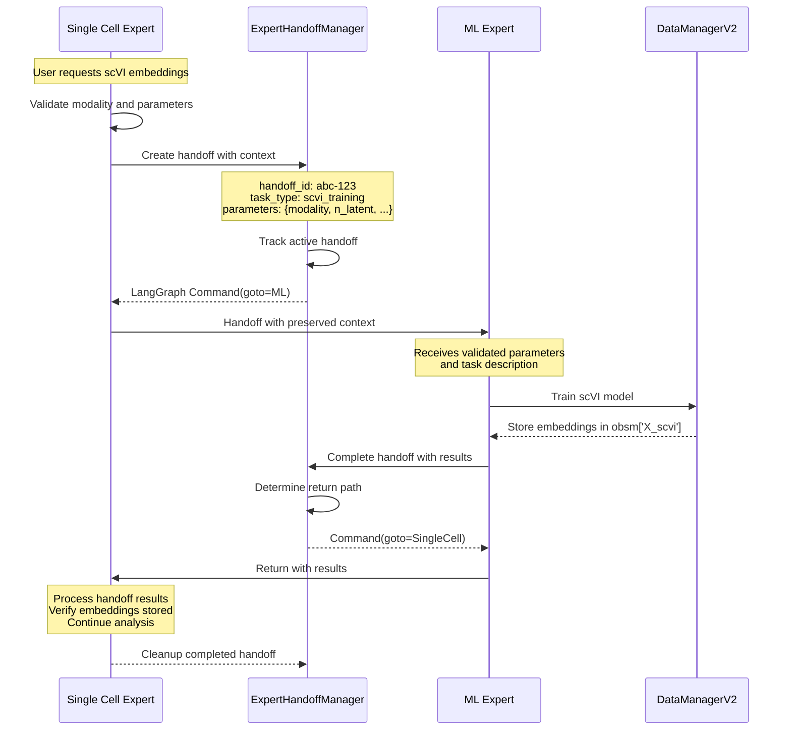

# 19. Agent System Architecture

## Overview

The Lobster AI agent system is built on a **hierarchical multi-agent architecture** using LangGraph for coordination. The system features a **centralized agent registry**, **dynamic tool generation**, and **specialized domain experts** that work together to provide comprehensive bioinformatics analysis capabilities.

## Core Architecture Components

### Agent Registry System

The heart of the agent system is the **centralized Agent Registry**, which serves as the single source of truth for all agent configurations and eliminates code duplication.

```mermaid
graph TB
    subgraph "Agent Registry Core"
        REGISTRY[Agent Registry<br/>📋 Single Source of Truth]
        CONFIG[AgentConfig Objects<br/>🔧 Metadata & Factory Functions]
        HELPERS[Helper Functions<br/>🛠️ Dynamic Loading & Discovery]
    end

    subgraph "System Integration"
        GRAPH[Graph Creation<br/>🕸️ LangGraph Agent Network]
        CALLBACKS[Callback System<br/>📊 Monitoring & Events]
        HANDOFFS[Handoff Tools<br/>🔄 Agent Communication]
    end

    subgraph "Dynamic Operations"
        IMPORT[Dynamic Import<br/>📦 Runtime Agent Loading]
        TOOLS[Tool Generation<br/>🔧 Automatic Handoff Creation]
        DETECT[Agent Detection<br/>🔍 System Discovery]
    end

    REGISTRY --> CONFIG
    CONFIG --> HELPERS

    HELPERS --> GRAPH
    HELPERS --> CALLBACKS
    CONFIG --> HANDOFFS

    CONFIG --> IMPORT
    HANDOFFS --> TOOLS
    HELPERS --> DETECT

    classDef registry fill:#e8f5e8,stroke:#2e7d32,stroke-width:3px
    classDef integration fill:#e1f5fe,stroke:#01579b,stroke-width:2px
    classDef dynamic fill:#fff3e0,stroke:#f57c00,stroke-width:2px

    class REGISTRY,CONFIG,HELPERS registry
    class GRAPH,CALLBACKS,HANDOFFS integration
    class IMPORT,TOOLS,DETECT dynamic
```



### AgentConfig Schema

Each agent is defined using a structured configuration object:

```python
@dataclass
class AgentRegistryConfig:
    """Configuration for an agent in the system."""
    name: str                              # Unique agent identifier
    display_name: str                     # Human-readable name
    description: str                      # Agent's capabilities description
    factory_function: str                 # Module path to factory function
    handoff_tool_name: Optional[str]     # Name of handoff tool
    handoff_tool_description: Optional[str]  # Tool description
```

## Agent Hierarchy

### Supervisor Agent

The **Supervisor Agent** serves as the orchestrator and decision-maker for the entire system:

#### Responsibilities
- **Request Routing** - Analyzes user queries and delegates to appropriate specialists
- **Workflow Coordination** - Maintains logical analysis sequences across agents
- **Context Management** - Ensures coherent conversation flow and data consistency
- **Direct Response** - Handles general questions without delegation

#### Decision Framework


### Specialist Agents

Each specialist agent focuses on a specific domain of bioinformatics analysis:

#### Data Expert Agent
- **Data Discovery** - Locating and cataloging biological datasets
- **Format Handling** - Supporting multiple input formats (CSV, H5AD, 10X MTX, Excel)
- **Quality Assessment** - Initial data validation and profiling
- **Workspace Management** - Organizing datasets and maintaining data lineage

#### Research Agent
- **Literature Mining** - PubMed, bioRxiv, medRxiv search capabilities
- **Dataset Discovery** - Direct GEO DataSets search with advanced filtering
- **Publication Analysis** - DOI/PMID to dataset association
- **Marker Gene Discovery** - Literature-based gene signature extraction

#### Single-Cell Expert Agent
- **Quality Control** - Comprehensive cell and gene filtering
- **Preprocessing** - Normalization, batch correction, doublet detection
- **Dimensionality Reduction** - PCA, UMAP, t-SNE implementation
- **Clustering Analysis** - Leiden/Louvain clustering with resolution optimization
- **Cell Type Annotation** - Manual and automated cell type assignment
- **Visualization** - QC plots, UMAP plots, feature plots, heatmaps

#### Bulk RNA-seq Expert Agent
- **Sample QC** - Sequencing depth and quality metrics
- **Differential Expression** - pyDESeq2 integration with statistical rigor
- **Pathway Analysis** - GO, KEGG, Reactome enrichment
- **Formula Construction** - R-style design matrices with agent guidance
- **Iterative Analysis** - Comparative DE analysis workflows

#### MS Proteomics Expert Agent
- **DDA/DIA Workflows** - MaxQuant and Spectronaut output processing
- **Missing Value Handling** - MNAR/MCAR pattern analysis (30-70% missing typical)
- **Intensity Normalization** - TMM, quantile, VSN methods
- **Statistical Testing** - Linear models with empirical Bayes
- **Pathway Enrichment** - Protein-centric pathway analysis

#### Affinity Proteomics Expert Agent
- **Targeted Panels** - Olink NPX processing and antibody array analysis
- **Low Missing Values** - Optimized for <30% missing data
- **CV Analysis** - Coefficient of variation assessment
- **Antibody Validation** - Quality control metrics for targeted assays
- **Panel Harmonization** - Cross-platform data integration

#### Method Expert Agent
- **Parameter Extraction** - Computational method details from publications
- **Protocol Analysis** - Cross-study methodology comparison
- **Parameter Consensus** - Evidence-based parameter recommendations
- **Method Validation** - Computational approach assessment

#### ML Expert Agent
- **Data Preparation** - Feature selection and normalization for ML
- **Framework Export** - sklearn, PyTorch, TensorFlow format conversion
- **Model Readiness** - Data quality assessment for ML workflows
- **Split Generation** - Stratified train/validation/test splits

## LangGraph Integration

### Graph Construction

The agent system is built on LangGraph's state machine framework:


### Dynamic Graph Creation

The system creates the LangGraph dynamically based on the Agent Registry:

```python
# Dynamic agent loading from registry
worker_agents = get_worker_agents()

for agent_name, agent_config in worker_agents.items():
    # Import factory function dynamically
    factory_function = import_agent_factory(agent_config.factory_function)

    # Create agent instance
    agent = factory_function(
        data_manager=data_manager,
        callback_handler=callback_handler,
        agent_name=agent_config.name,
        handoff_tools=None
    )

    # Create handoff tool
    handoff_tool = create_custom_handoff_tool(
        agent_name=agent_config.name,
        name=agent_config.handoff_tool_name,
        description=agent_config.handoff_tool_description
    )
```

## Communication Patterns

### Handoff Mechanism

Agents communicate through **handoff tools** that are automatically generated from the registry:


### State Management

Each agent maintains state through the shared DataManagerV2 instance:

- **Modality Access** - Agents retrieve and store data through named modalities
- **Tool Usage Logging** - All operations are tracked for provenance
- **Plot Management** - Visualizations are centrally managed and accessible
- **Metadata Preservation** - Analysis parameters and results are stored

## Enhanced Expert Handoff System

The Lobster platform features a **sophisticated expert-to-expert handoff system** that enables true agent collaboration with context preservation, automatic return flow management, and type-safe parameter passing.

### Architecture Overview

```mermaid
graph TB
    subgraph "Enhanced Handoff Infrastructure"
        EHM[ExpertHandoffManager<br/>🎯 Central Coordinator]
        EHT[Enhanced Handoff Tools<br/>🔧 Type-Safe Validation]
        HP[Handoff Patterns<br/>📋 Standardized Collaborations]
    end

    subgraph "Core Features"
        CP[Context Preservation<br/>💾 Parameter Passing]
        RF[Return Flow Logic<br/>🔄 A→B→A Patterns]
        VL[Schema Validation<br/>✅ Type Safety]
        EH[Error Handling<br/>🛡️ Graceful Degradation]
    end

    subgraph "Registry Integration"
        AR[Agent Registry<br/>📋 Available Agents]
        AT[Automatic Tools<br/>⚡ Dynamic Generation]
        PM[Pattern Matching<br/>🎯 Smart Routing]
    end

    EHM --> CP
    EHM --> RF
    EHT --> VL
    EHT --> EH
    HP --> PM
    AR --> AT
    AT --> EHT

    classDef infrastructure fill:#e8f5e8,stroke:#2e7d32,stroke-width:3px
    classDef features fill:#e1f5fe,stroke:#01579b,stroke-width:2px
    classDef registry fill:#fff3e0,stroke:#f57c00,stroke-width:2px

    class EHM,EHT,HP infrastructure
    class CP,RF,VL,EH features
    class AR,AT,PM registry
```



### Expert Handoff Manager

The **ExpertHandoffManager** serves as the central coordinator for all inter-agent communications:

```python
from lobster.tools.expert_handoff_manager import expert_handoff_manager

# Create context-preserving handoff
handoff_context = create_handoff_context(
    from_expert="singlecell_expert",
    to_expert="machine_learning_expert",
    task_type="scvi_training",
    parameters={"modality_name": "data", "n_latent": 10},
    return_expectations={"embedding_key": "X_scvi"}
)

# Execute handoff with tracking
command = expert_handoff_manager.create_context_preserving_handoff(
    to_expert="machine_learning_expert",
    context=handoff_context,
    return_to_sender=True
)
```

**Key Capabilities:**
- **Context Preservation**: Full parameter and state passing between agents
- **Chain Tracking**: Supports A→B→C→A patterns with loop prevention
- **Return Flow Management**: Automatic routing back to sender or supervisor
- **Audit Trail**: Complete handoff history for debugging and monitoring
- **Concurrent Support**: Multiple simultaneous handoffs without interference

### Standardized Handoff Patterns

The system includes **15+ pre-defined handoff patterns** for common expert collaborations:

```python
# Single Cell Expert → ML Expert (scVI training)
"singlecell_to_ml": {
    "task_types": ["scvi_training", "deep_learning_embedding"],
    "context_schema": SCVI_CONTEXT_SCHEMA,
    "return_flow": "sender",
    "priority": 10
}

# Single Cell Expert → Bulk RNA-seq Expert (pseudobulk analysis)
"singlecell_to_bulk": {
    "task_types": ["pseudobulk_analysis", "differential_expression"],
    "context_schema": PSEUDOBULK_CONTEXT_SCHEMA,
    "return_flow": "sender",
    "priority": 8
}

# Data Expert → Research Agent (dataset discovery)
"data_to_research": {
    "task_types": ["dataset_search", "metadata_extraction"],
    "context_schema": DATA_LOADING_SCHEMA,
    "return_flow": "sender",
    "priority": 7
}
```

### Enhanced Handoff Workflow

**Example: Single Cell Expert → ML Expert → Single Cell Expert (scVI Training)**



### Type-Safe Context Validation

All handoffs use **schema-based validation** for type safety:

```python
# Schema definitions for different handoff types
SCVI_CONTEXT_SCHEMA = {
    "modality_name": str,
    "n_latent": int,
    "batch_key": Optional[str],
    "max_epochs": int,
    "use_gpu": bool
}

# Validation with detailed error messages
def validate_context_schema(context: Dict[str, Any], schema: Dict[str, Type]):
    """Validate context against schema with detailed error reporting."""
    validated = {}
    errors = []

    for field_name, field_type in schema.items():
        if field_name not in context and not _is_optional(field_type):
            errors.append(f"Required field '{field_name}' is missing")
        elif field_name in context:
            value = context[field_name]
            if not _validate_type(value, field_type):
                errors.append(f"Field '{field_name}' must be {field_type}")

    if errors:
        raise ValueError(f"Context validation failed: {'; '.join(errors)}")

    return validated
```

### Automatic Tool Registration

The **Agent Registry System** automatically creates handoff tools based on available agents:

```python
# Automatic handoff tool creation
def create_expert_handoff_tools(available_agents: List[str]) -> Dict[str, BaseTool]:
    """Create handoff tools for all compatible expert pairs."""
    handoff_tools = {}

    for pattern_name, pattern in EXPERT_HANDOFF_PATTERNS.items():
        if both_experts_available(pattern, available_agents):
            for task_type in pattern.task_types:
                tool_name = f"handoff_{pattern.from_expert}_to_{pattern.to_expert}_{task_type}"
                handoff_tools[tool_name] = create_expert_handoff_tool(
                    from_expert=pattern.from_expert,
                    to_expert=pattern.to_expert,
                    task_type=task_type,
                    context_schema=pattern.context_schema,
                    return_to_sender=(pattern.return_flow == "sender")
                )

    return handoff_tools
```

### Error Handling & Recovery

The enhanced handoff system includes **comprehensive error handling**:

```python
# Graceful error handling in handoff tools
try:
    # Validate context against schema
    validated_context = validate_context_schema(context, SCVI_CONTEXT_SCHEMA)

    # Create and execute handoff
    handoff_command = expert_handoff_manager.create_context_preserving_handoff(
        to_expert="machine_learning_expert",
        context=handoff_context,
        return_to_sender=True
    )

    return handoff_command

except ValueError as e:
    # Context validation failed
    return Command(
        goto="__end__",
        update={
            "messages": state["messages"] + [
                AIMessage(content=f"❌ Handoff validation failed: {str(e)}")
            ],
            "handoff_error": str(e)
        }
    )

except Exception as e:
    # Unexpected error - graceful degradation
    return Command(
        goto="__end__",
        update={
            "messages": state["messages"] + [
                AIMessage(content=f"❌ Handoff failed: {str(e)}")
            ]
        }
    )
```

### Monitoring & Debugging

The handoff system provides **comprehensive monitoring** capabilities:

```python
# Get active handoffs for monitoring
active_handoffs = expert_handoff_manager.get_active_handoffs()

# Get handoff history for debugging
history = expert_handoff_manager.get_handoff_history(limit=50)

# Registry summary for system overview
from lobster.config.agent_registry import get_handoff_registry_summary
summary = get_handoff_registry_summary()

# Example summary:
{
    "total_patterns": 15,
    "available_agents": 8,
    "patterns_by_priority": {10: [...], 9: [...], 8: [...]},
    "handoff_matrix": {
        "singlecell_expert": {
            "machine_learning_expert": True,
            "bulk_rnaseq_expert": True,
            "research_agent": False
        }
    }
}
```

### Performance Characteristics

- **Handoff Overhead**: <100ms for context passing
- **Memory Usage**: Minimal - only active contexts stored
- **Scalability**: Supports concurrent handoffs without interference
- **Error Recovery**: Automatic cleanup and rollback on failures
- **Chain Protection**: Maximum depth limit prevents infinite loops (default: 10)

## Agent Tool Pattern

All agents follow a consistent tool implementation pattern:

```python
@tool
def analyze_data(modality_name: str, **params) -> str:
    """Standard agent tool pattern."""
    try:
        # 1. Validate modality exists
        if modality_name not in data_manager.list_modalities():
            raise ModalityNotFoundError(f"Modality '{modality_name}' not found")

        # 2. Get data from modality system
        adata = data_manager.get_modality(modality_name)

        # 3. Call stateless service for processing
        result_adata, statistics = service.analyze(adata, **params)

        # 4. Store results with descriptive naming
        new_modality = f"{modality_name}_analyzed"
        data_manager.modalities[new_modality] = result_adata

        # 5. Log operation for provenance
        data_manager.log_tool_usage("analyze_data", params, statistics)

        # 6. Return formatted response
        return format_analysis_response(statistics, new_modality)

    except ServiceError as e:
        logger.error(f"Service error: {e}")
        return f"Analysis failed: {str(e)}"
    except Exception as e:
        logger.error(f"Unexpected error: {e}")
        return f"Unexpected error: {str(e)}"
```

## Registry Management

### Adding New Agents

The centralized registry makes adding new agents straightforward:

**Before (Legacy System)**:
```
Adding agents required updating:
├── lobster/agents/graph.py          # Import statements
├── lobster/agents/graph.py          # Agent creation code
├── lobster/agents/graph.py          # Handoff tool definitions
├── lobster/utils/callbacks.py       # Agent name hardcoded list
└── Multiple imports throughout codebase
```

**After (Registry System)**:
```
Adding agents only requires:
└── lobster/config/agent_registry.py  # Single registry entry

Everything else is automatic:
├── ✅ Dynamic agent loading
├── ✅ Automatic handoff tool creation
├── ✅ Callback system integration
├── ✅ Type-safe configuration
└── ✅ Professional error handling
```

### Registry Helper Functions

The registry provides utility functions for system integration:

```python
# Get all worker agents with configurations
worker_agents = get_worker_agents()
# Returns: Dict[str, AgentRegistryConfig]

# Get all agent names (including system agents)
all_agents = get_all_agent_names()
# Returns: List[str]

# Dynamically import agent factory
factory = import_agent_factory('lobster.agents.data_expert.data_expert')
# Returns: Callable
```

## Error Handling & Monitoring

### Hierarchical Error Handling

The agent system implements comprehensive error handling:

- **Agent-Level Errors** - Tool failures, validation errors, service exceptions
- **Communication Errors** - Handoff failures, state corruption, timeout issues
- **System-Level Errors** - Registry failures, import errors, configuration issues

### Callback System Integration

The callback system monitors agent activities:

```python
# Agent activity tracking
callback.on_agent_start(agent_name, input_data)
callback.on_tool_start(tool_name, input_args)
callback.on_tool_end(tool_name, output)
callback.on_agent_end(agent_name, output)

# Error tracking
callback.on_agent_error(agent_name, error)
callback.on_tool_error(tool_name, error)
```

## Performance & Scalability

### Agent Lifecycle Management

- **Lazy Loading** - Agents are created only when needed
- **Stateless Design** - Agents don't maintain persistent state beyond DataManagerV2
- **Resource Cleanup** - Automatic cleanup of temporary resources
- **Memory Efficiency** - Shared data structures through DataManagerV2

### Parallel Processing Capabilities

- **Independent Operations** - Agents can process different modalities simultaneously
- **Batch Processing** - Support for bulk operations across multiple datasets
- **Async Communication** - Non-blocking agent interactions where possible

## Testing & Quality Assurance

### Agent Registry Testing

```python
def test_agent_registry():
    """Test the agent registry functionality."""
    # Verify all agents are registered
    worker_agents = get_worker_agents()
    assert len(worker_agents) > 0

    # Validate factory function imports
    for agent_name, config in worker_agents.items():
        factory = import_agent_factory(config.factory_function)
        assert callable(factory)

    # Check agent name consistency
    all_agents = get_all_agent_names()
    assert 'data_expert_agent' in all_agents
```

### Integration Testing

- **End-to-End Workflows** - Complete analysis pipelines
- **Agent Communication** - Handoff mechanism validation
- **Error Recovery** - Graceful handling of failures
- **State Consistency** - DataManagerV2 integration testing

This agent system architecture provides a robust, extensible, and maintainable foundation for complex bioinformatics workflows while maintaining clear separation of concerns and professional software engineering practices.