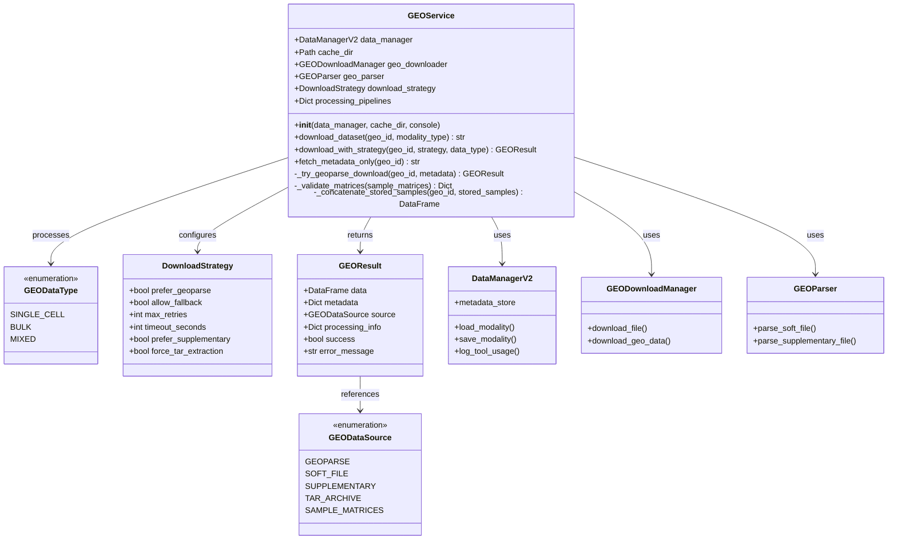
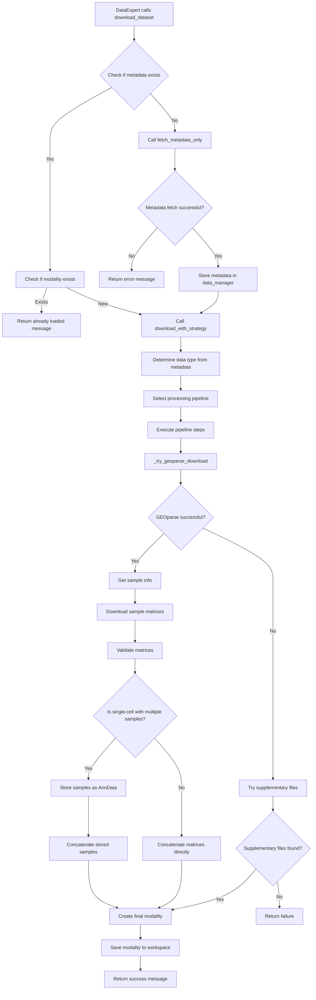
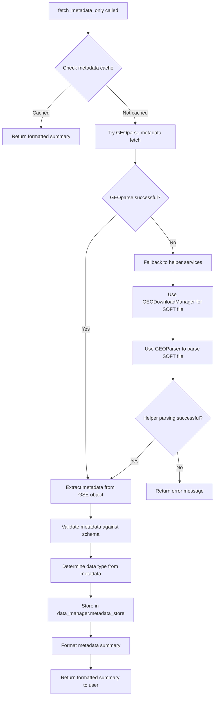
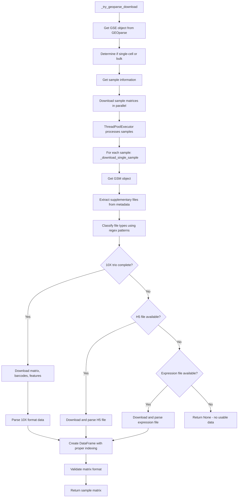
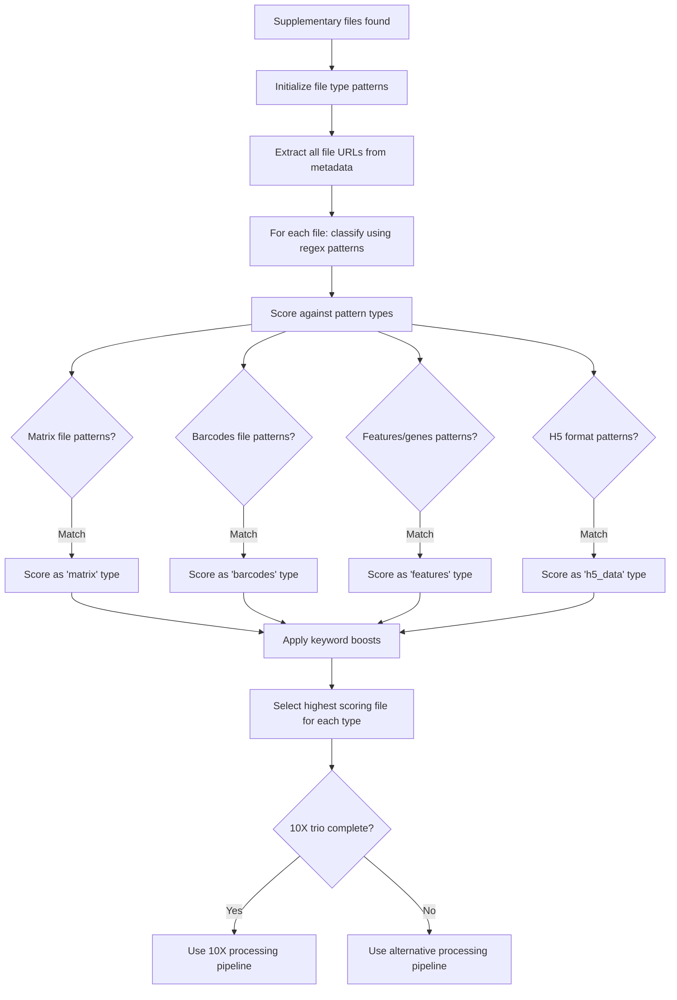
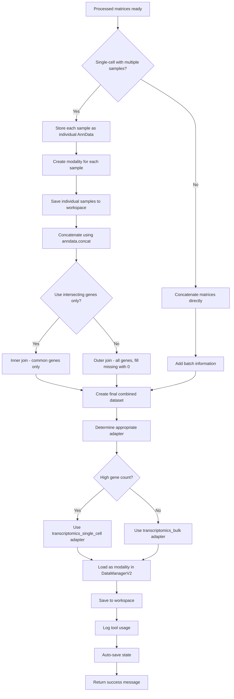
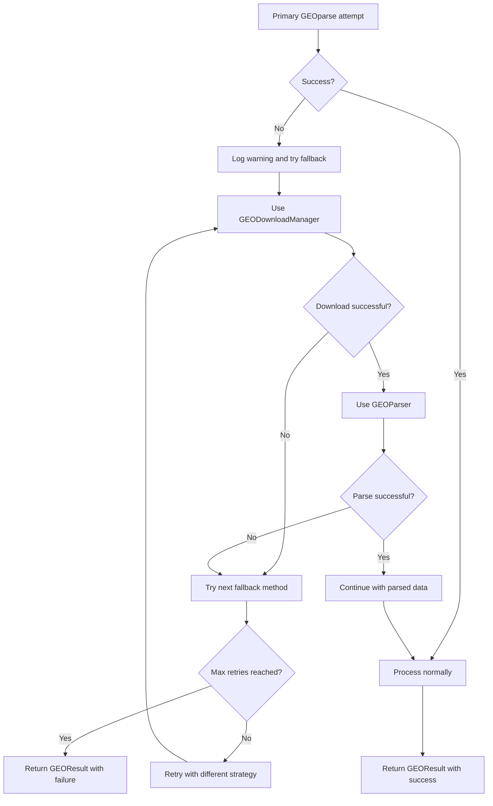

# GEO Service Architecture - Mermaid Schema

## Class Structure and Data Flow

## Main Process Flow

## Metadata Processing Flow

## Sample Processing Pipeline

## File Classification System

## Data Storage and Integration

## Error Handling and Fallback Strategy

## Key Design Patterns

1. **Strategy Pattern**: `DownloadStrategy` configures download behavior
2. **Template Method**: `download_with_strategy` defines the algorithm skeleton
3. **Factory Pattern**: Processing pipelines created based on data type
4. **Observer Pattern**: Progress tracking through console and logging
5. **Facade Pattern**: `GEOService` provides simplified interface to complex subsystems
6. **Command Pattern**: Each pipeline step is a callable function
7. **Builder Pattern**: `GEOResult` accumulates processing information

## Data Flow Summary

The service follows a layered approach:
1. **Metadata Layer**: Fetch and validate metadata first
2. **Strategy Layer**: Determine download approach based on data type
3. **Processing Layer**: Execute pipeline steps with fallbacks
4. **Validation Layer**: Ensure data quality and format
5. **Storage Layer**: Integrate with DataManagerV2 for persistence
6. **Integration Layer**: Provide seamless access to processed data
