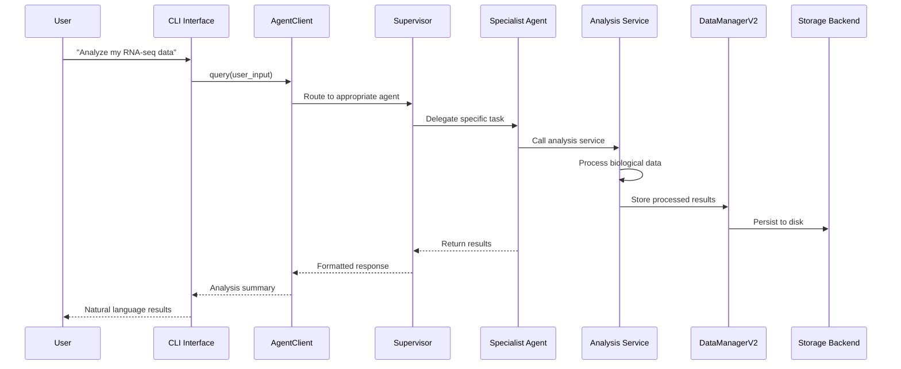

# 18. Architecture Overview

## System Overview

Lobster AI is a professional **multi-agent bioinformatics analysis platform** that combines specialized AI agents with proven scientific tools to analyze complex multi-omics data. The platform features a modular, service-oriented architecture that enables natural language interaction with sophisticated bioinformatics workflows.

### Core Design Principles

1. **Agent-Based Architecture** - Specialist agents coordinated through centralized registry
2. **Service-Oriented Processing** - Stateless, testable analysis services
3. **Cloud/Local Hybrid** - Seamless switching between deployment modes
4. **Modular Design** - Extensible components with clean interfaces
5. **Natural Language Interface** - User describes analyses in plain English
6. **Publication-Quality Output** - Interactive visualizations with scientific rigor

## High-Level System Architecture

```mermaid
graph TB
    subgraph "User Interface Layer"
        CLI[🦞 Lobster CLI<br/>Interactive Terminal]
        WEB[📊 Streamlit Web UI<br/>Visual Interface]
        API[🔌 FastAPI Server<br/>HTTP Endpoints]
    end

    subgraph "Client Detection & Routing"
        DETECT[Environment Detection<br/>LOBSTER_CLOUD_KEY?]
        ADAPTER[LobsterClientAdapter<br/>Unified Interface]
    end

    subgraph "☁️ Cloud Mode"
        CLOUD_CLIENT[CloudLobsterClient<br/>HTTP API Calls]
        CLOUD_API[Lobster Cloud API<br/>Managed Infrastructure]
    end

    subgraph "💻 Local Mode"
        LOCAL_CLIENT[AgentClient<br/>Local LangGraph]
        AGENT_GRAPH[Multi-Agent Graph<br/>LangGraph Coordination]
        DATA_MANAGER[DataManagerV2<br/>Modality Orchestration]
    end

    CLI --> DETECT
    WEB --> DETECT
    API --> DETECT

    DETECT --> ADAPTER
    ADAPTER --> |Cloud Key Present| CLOUD_CLIENT
    ADAPTER --> |Local/Fallback| LOCAL_CLIENT

    CLOUD_CLIENT --> CLOUD_API
    LOCAL_CLIENT --> AGENT_GRAPH
    AGENT_GRAPH --> DATA_MANAGER

    classDef interface fill:#e3f2fd,stroke:#0277bd,stroke-width:2px
    classDef detection fill:#fff3e0,stroke:#f57c00,stroke-width:2px
    classDef cloud fill:#e8f5e8,stroke:#2e7d32,stroke-width:2px
    classDef local fill:#f3e5f5,stroke:#4a148c,stroke-width:2px

    class CLI,WEB,API interface
    class DETECT,ADAPTER detection
    class CLOUD_CLIENT,CLOUD_API cloud
    class LOCAL_CLIENT,AGENT_GRAPH,DATA_MANAGER local
```



## Technology Stack

### Core Technologies

| Component | Technology | Purpose |
|-----------|------------|---------|
| **Agent Framework** | LangGraph | Multi-agent coordination and workflows |
| **AI Models** | AWS Bedrock, OpenAI | Large language models for agent intelligence |
| **Data Management** | AnnData, MuData | Biological data structures and storage |
| **Bioinformatics** | Scanpy, PyDESeq2 | Scientific analysis algorithms |
| **Web Interface** | Streamlit | Interactive web-based UI |
| **CLI Interface** | Typer, Rich | Terminal-based interaction |
| **Visualization** | Plotly | Interactive scientific plots |
| **Storage** | H5AD, HDF5 | Efficient biological data storage |

### Language and Dependencies

- **Python 3.12+** - Core language with modern features
- **Async/Await** - For responsive user interfaces
- **Type Hints** - Professional code quality and IDE support
- **Pydantic** - Data validation and configuration management

## Data Flow Architecture



## Core System Components

### 1. Agent System

The heart of Lobster AI is its multi-agent architecture, where specialized AI agents handle different aspects of bioinformatics analysis:

- **Supervisor Agent** - Routes requests and coordinates workflows
- **Data Expert** - Handles data loading and quality assessment
- **Single-Cell Expert** - Specializes in scRNA-seq analysis
- **Bulk RNA-seq Expert** - Handles bulk transcriptomics
- **MS Proteomics Expert** - Mass spectrometry proteomics analysis
- **Affinity Proteomics Expert** - Targeted protein analysis
- **Research Agent** - Literature mining and dataset discovery
- **Method Expert** - Parameter extraction from publications

### 2. Service Layer

Stateless analysis services provide the computational backbone:

#### Transcriptomics Services
- **PreprocessingService** - Quality control, filtering, normalization
- **QualityService** - Multi-metric assessment and validation
- **ClusteringService** - Leiden clustering, UMAP, cell annotation
- **EnhancedSingleCellService** - Doublet detection, marker genes
- **BulkRNASeqService** - Differential expression with pyDESeq2
- **PseudobulkService** - Single-cell to bulk aggregation

#### Proteomics Services
- **ProteomicsPreprocessingService** - MS/affinity data filtering
- **ProteomicsQualityService** - Missing value analysis, CV assessment
- **ProteomicsAnalysisService** - Statistical testing, PCA
- **ProteomicsDifferentialService** - Linear models, FDR control

#### Supporting Services
- **GEOService** - Dataset downloading and metadata extraction
- **PublicationService** - Literature mining and parameter extraction
- **VisualizationService** - Interactive plot generation
- **ConcatenationService** - Memory-efficient sample merging

### 3. Data Management Layer

**DataManagerV2** orchestrates all data operations:

- **Modality Management** - Named biological datasets with metadata
- **Adapter System** - Format-specific data loading (transcriptomics, proteomics)
- **Storage Backends** - Flexible persistence (H5AD, MuData)
- **Schema Validation** - Data quality enforcement
- **Provenance Tracking** - Complete analysis history (W3C-PROV compliant)

### 4. Configuration & Registry

Centralized configuration management:

- **Agent Registry** - Single source of truth for all agents
- **Settings Management** - Environment-aware configuration
- **Model Configuration** - LLM parameters and API keys
- **Adapter Registry** - Dynamic data format support

## Component Relationships

```mermaid
graph LR
    subgraph "Agent Layer"
        AGENTS[Specialized Agents<br/>🤖 Domain Experts]
    end

    subgraph "Service Layer"
        SERVICES[Analysis Services<br/>🔬 Stateless Processing]
    end

    subgraph "Data Layer"
        DM[DataManagerV2<br/>📊 Orchestration]
        ADAPTERS[Modality Adapters<br/>🔄 Format Support]
        BACKENDS[Storage Backends<br/>💾 Persistence]
    end

    subgraph "Infrastructure"
        CONFIG[Configuration<br/>⚙️ Settings & Registry]
        INTERFACES[Base Interfaces<br/>📋 Contracts]
    end

    AGENTS --> SERVICES
    SERVICES --> DM
    DM --> ADAPTERS
    DM --> BACKENDS

    AGENTS -.-> CONFIG
    SERVICES -.-> CONFIG
    DM -.-> CONFIG

    ADAPTERS -.-> INTERFACES
    BACKENDS -.-> INTERFACES

    classDef agent fill:#e1f5fe,stroke:#01579b,stroke-width:2px
    classDef service fill:#e8f5e8,stroke:#2e7d32,stroke-width:2px
    classDef data fill:#fff3e0,stroke:#f57c00,stroke-width:2px
    classDef infra fill:#f3e5f5,stroke:#4a148c,stroke-width:2px

    class AGENTS agent
    class SERVICES service
    class DM,ADAPTERS,BACKENDS data
    class CONFIG,INTERFACES infra
```



## Modality System

Lobster AI uses a modality-centric approach to handle different types of biological data:

### Supported Data Types

1. **Single-Cell RNA-seq** - 10X, H5AD, CSV formats
2. **Bulk RNA-seq** - Count matrices, TPM/FPKM data
3. **Mass Spectrometry Proteomics** - MaxQuant, Spectronaut outputs
4. **Affinity Proteomics** - Olink NPX, antibody array data
5. **Multi-Omics** - Integrated analysis with MuData

### Professional Naming Convention

```
geo_gse12345                          # Raw dataset
├── geo_gse12345_quality_assessed     # QC metrics added
├── geo_gse12345_filtered_normalized  # Preprocessed
├── geo_gse12345_doublets_detected    # Quality control
├── geo_gse12345_clustered           # Analysis results
├── geo_gse12345_markers             # Feature identification
└── geo_gse12345_annotated           # Final annotations
```

## Performance & Scalability

### Memory Management

- **Sparse Matrix Support** - Efficient single-cell data handling
- **Chunked Processing** - Large dataset memory optimization
- **Lazy Loading** - On-demand data access
- **Smart Caching** - Intelligent cache management (60s cloud, 10s local)

### Computational Efficiency

- **Stateless Services** - Parallelizable processing units
- **Vectorized Operations** - NumPy/SciPy optimization
- **GPU Detection** - Automatic hardware utilization
- **Background Processing** - Non-blocking operations

## Quality & Standards

### Data Quality Compliance

- **60% Compliant** - Full publication-grade standards
- **26% Partially Compliant** - Advanced features with minor gaps
- **14% Not Compliant** - Basic functionality only

### Error Handling

- **Hierarchical Exceptions** - Specific error types for different failures
- **Graceful Degradation** - Fallback mechanisms for robustness
- **Comprehensive Logging** - Detailed operation tracking
- **User-Friendly Messages** - Clear error explanations with suggestions

## Extension Points

The architecture is designed for easy extension:

### Adding New Agents

1. Implement agent factory function
2. Add entry to Agent Registry
3. System automatically integrates handoff tools and callbacks

### Adding New Services

1. Implement stateless service class
2. Follow AnnData input/output pattern
3. Add comprehensive error handling and logging

### Adding New Data Formats

1. Implement modality adapter
2. Register with DataManagerV2
3. Add schema validation rules

### Adding New Storage Backends

1. Implement IDataBackend interface
2. Register with DataManagerV2
3. Add format-specific optimization

This modular architecture ensures that Lobster AI can evolve with the rapidly changing bioinformatics landscape while maintaining reliability and ease of use.