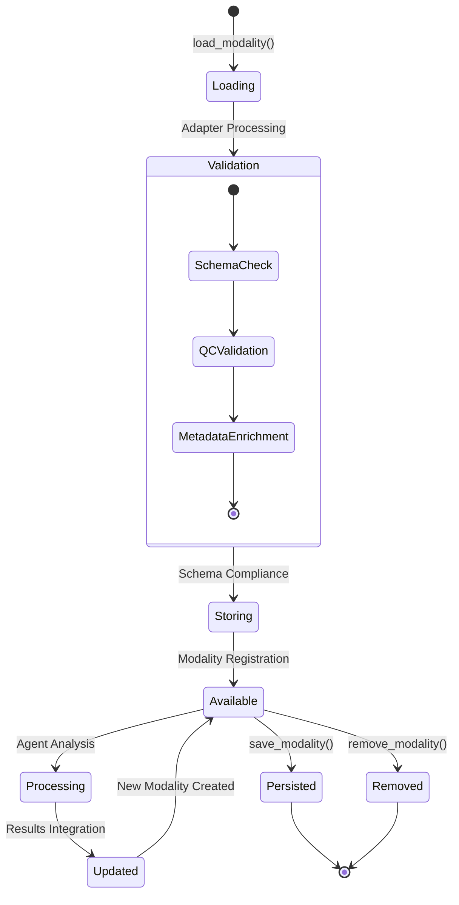

# 20. Data Management Architecture

## Overview

The Lobster AI data management system is built around **DataManagerV2**, a modular orchestration layer that provides unified access to multi-omics biological data. The system supports multiple data formats, storage backends, and validation schemas while maintaining complete provenance tracking and professional-grade data management practices.

## Core Architecture

### DataManagerV2 Orchestration

DataManagerV2 serves as the central data orchestrator, providing a clean interface between agents and the underlying data infrastructure:

```mermaid
graph TB
    subgraph "Agent Layer"
        AGENTS[Specialized Agents<br/>🤖 Data Consumers]
    end

    subgraph "DataManagerV2 Core"
        DM2[DataManagerV2<br/>🎯 Central Orchestrator]
        MODALITIES[Named Modalities<br/>📊 AnnData Objects]
        METADATA[Metadata Store<br/>🗃️ Dataset Information]
        PROVENANCE[Provenance Tracker<br/>📋 W3C-PROV Compliant]
    end

    subgraph "Adapter Layer"
        TRANS_ADAPTER[TranscriptomicsAdapter<br/>🧬 RNA-seq Processing]
        PROT_ADAPTER[ProteomicsAdapter<br/>🧪 Protein Processing]

        subgraph "Data Type Support"
            SC[Single-Cell RNA-seq]
            BULK[Bulk RNA-seq]
            MS[Mass Spectrometry]
            AFFINITY[Affinity Proteomics]
        end
    end

    subgraph "Storage Layer"
        H5AD[H5ADBackend<br/>💾 Single Modality Storage]
        MUDATA[MuDataBackend<br/>🔗 Multi-Modal Storage]
    end

    subgraph "Schema & Validation"
        TRANS_SCHEMA[TranscriptomicsSchema<br/>📋 RNA-seq Validation]
        PROT_SCHEMA[ProteomicsSchema<br/>📋 Protein Validation]
        FLEXIBLE_VAL[FlexibleValidator<br/>⚠️ Warning-Based QC]
    end

    AGENTS --> DM2
    DM2 --> MODALITIES
    DM2 --> METADATA
    DM2 --> PROVENANCE

    DM2 --> TRANS_ADAPTER
    DM2 --> PROT_ADAPTER

    TRANS_ADAPTER --> SC
    TRANS_ADAPTER --> BULK
    PROT_ADAPTER --> MS
    PROT_ADAPTER --> AFFINITY

    MODALITIES --> H5AD
    MODALITIES --> MUDATA

    TRANS_ADAPTER --> TRANS_SCHEMA
    PROT_ADAPTER --> PROT_SCHEMA
    TRANS_SCHEMA --> FLEXIBLE_VAL
    PROT_SCHEMA --> FLEXIBLE_VAL

    classDef agent fill:#e1f5fe,stroke:#01579b,stroke-width:2px
    classDef orchestrator fill:#f3e5f5,stroke:#4a148c,stroke-width:3px
    classDef adapter fill:#e8f5e8,stroke:#2e7d32,stroke-width:2px
    classDef storage fill:#fff3e0,stroke:#f57c00,stroke-width:2px
    classDef schema fill:#fce4ec,stroke:#c2185b,stroke-width:2px
    classDef datatype fill:#f1f8e9,stroke:#388e3c,stroke-width:2px

    class AGENTS agent
    class DM2,MODALITIES,METADATA,PROVENANCE orchestrator
    class TRANS_ADAPTER,PROT_ADAPTER adapter
    class H5AD,MUDATA storage
    class TRANS_SCHEMA,PROT_SCHEMA,FLEXIBLE_VAL schema
    class SC,BULK,MS,AFFINITY datatype
```



### Key Design Principles

1. **Modality-Centric Approach** - All data is organized as named modalities with descriptive naming
2. **Format Agnostic** - Support for multiple input formats through adapter pattern
3. **Schema Validation** - Automatic data quality enforcement with scientific standards
4. **Provenance Tracking** - Complete analysis history with W3C-PROV compliance
5. **Extensible Architecture** - Easy addition of new data types and storage backends

## Modality System

### Professional Naming Convention

The system enforces a professional naming convention that tracks analysis workflows:

```
geo_gse12345                          # Raw downloaded dataset
├── geo_gse12345_quality_assessed     # QC metrics added
├── geo_gse12345_filtered_normalized  # Preprocessed data
├── geo_gse12345_doublets_detected    # Quality control applied
├── geo_gse12345_clustered           # Analysis results
├── geo_gse12345_markers             # Feature identification
├── geo_gse12345_annotated           # Final annotations
└── geo_gse12345_pseudobulk          # Aggregated for DE analysis
```

### Modality Lifecycle



### Data Operations

#### Loading Data

```python
# Load with automatic adapter detection
adata = data_manager.load_modality(
    name="geo_gse12345",
    source="path/to/data.h5ad",
    adapter="transcriptomics_single_cell",
    validate=True
)

# Load with metadata enrichment
adata = data_manager.load_modality(
    name="proteomics_sample",
    source=dataframe,
    adapter="proteomics_ms",
    sample_metadata=metadata_df,
    experimental_design="case_control"
)
```

#### Accessing Data

```python
# Get specific modality
adata = data_manager.get_modality("geo_gse12345_clustered")

# List all modalities
modalities = data_manager.list_modalities()

# Get quality metrics
metrics = data_manager.get_quality_metrics("geo_gse12345")
```

#### Data Persistence

```python
# Save individual modality
path = data_manager.save_modality(
    name="geo_gse12345_processed",
    path="processed_data.h5ad"
)

# Save multi-modal dataset
path = data_manager.save_mudata(
    path="integrated_analysis.h5mu",
    modalities=["rna_seq", "proteomics"]
)
```

## Adapter System

### Base Adapter Pattern

All adapters implement the `IModalityAdapter` interface:

```python
class IModalityAdapter(ABC):
    @abstractmethod
    def from_source(self, source: Any, **kwargs) -> anndata.AnnData:
        """Load data from source and convert to AnnData."""
        pass

    @abstractmethod
    def validate(self, adata: anndata.AnnData, strict: bool = False) -> ValidationResult:
        """Validate AnnData against schema."""
        pass

    @abstractmethod
    def get_quality_metrics(self, adata: anndata.AnnData) -> Dict[str, Any]:
        """Calculate quality control metrics."""
        pass
```

### Transcriptomics Adapter

Handles single-cell and bulk RNA-seq data:

#### Features
- **Format Support** - CSV, TSV, H5AD, 10X MTX, Excel formats
- **Auto-Detection** - Intelligent format and transpose detection
- **QC Integration** - Automatic quality control metrics calculation
- **Metadata Enrichment** - Sample and gene annotation support

#### Usage Examples

```python
# Single-cell RNA-seq
adapter = TranscriptomicsAdapter(
    data_type="single_cell",
    strict_validation=False
)

adata = adapter.from_source(
    source="counts.csv",
    transpose=True,
    gene_symbols_col="gene_name",
    sample_metadata=metadata_df
)

# Bulk RNA-seq
adapter = TranscriptomicsAdapter(
    data_type="bulk",
    strict_validation=True
)

adata = adapter.from_source(
    source=count_matrix,
    experimental_design="factorial",
    batch_correction_method="combat"
)
```

### Proteomics Adapter

Handles mass spectrometry and affinity proteomics data:

#### Features
- **MS Support** - MaxQuant, Spectronaut, generic intensity matrices
- **Affinity Support** - Olink NPX, antibody arrays, targeted panels
- **Missing Value Handling** - MNAR/MCAR pattern analysis
- **Normalization** - TMM, quantile, VSN methods

#### Usage Examples

```python
# Mass spectrometry proteomics
adapter = ProteomicsAdapter(
    data_type="mass_spectrometry",
    strict_validation=False
)

adata = adapter.from_source(
    source="proteinGroups.txt",
    intensity_columns=["LFQ intensity"],
    missing_value_threshold=0.7,
    normalize_method="tmm"
)

# Affinity proteomics
adapter = ProteomicsAdapter(
    data_type="affinity",
    strict_validation=True
)

adata = adapter.from_source(
    source="olink_data.csv",
    npx_columns=True,
    panel_info=panel_metadata,
    cv_threshold=0.15
)
```

## Storage Backend System

### Backend Interface

All backends implement the `IDataBackend` interface:

```python
class IDataBackend(ABC):
    @abstractmethod
    def save(self, data: anndata.AnnData, path: Union[str, Path], **kwargs) -> str:
        """Save AnnData to storage."""
        pass

    @abstractmethod
    def load(self, path: Union[str, Path], **kwargs) -> anndata.AnnData:
        """Load AnnData from storage."""
        pass

    @abstractmethod
    def get_storage_info(self) -> Dict[str, Any]:
        """Get backend storage information."""
        pass
```

### H5AD Backend

Single-modality storage with S3-ready architecture:

#### Features
- **Local Storage** - Efficient HDF5-based storage
- **S3-Ready** - Path parsing ready for future cloud storage
- **Compression** - Configurable compression levels
- **Backed Mode** - Memory-efficient loading for large datasets

#### Configuration

```python
h5ad_backend = H5ADBackend(
    base_path=workspace_path / "data",
    compression="gzip",
    compression_opts=6
)

# Future S3 configuration (prepared)
h5ad_backend.s3_config = {
    "bucket": "lobster-data",
    "region": "us-west-2",
    "access_key": "key",
    "secret_key": "secret"
}
```

### MuData Backend

Multi-modal storage for integrated analysis:

#### Features
- **Multi-Modal** - Unified storage for multiple omics types
- **Cross-Modal Analysis** - Support for integrated workflows
- **Metadata Preservation** - Complete analysis context retention
- **Format Compatibility** - Integration with existing single-modal data

#### Usage

```python
# Create integrated dataset
mdata = data_manager.to_mudata(
    modalities=["rna_seq", "proteomics", "metabolomics"]
)

# Save multi-modal analysis
path = data_manager.save_mudata(
    path="integrated_multiomics.h5mu",
    modalities=["processed_rna", "processed_proteins"]
)
```

## Schema Validation System

### Validation Architecture

The validation system provides scientific data quality enforcement:

```mermaid
graph LR
    subgraph "Schema Types"
        TRANS[TranscriptomicsSchema<br/>🧬 RNA-seq Rules]
        PROT[ProteomicsSchema<br/>🧪 Protein Rules]
    end

    subgraph "Validation Levels"
        STRICT[Strict Mode<br/>❌ Errors on Violations]
        FLEXIBLE[Flexible Mode<br/>⚠️ Warnings for Issues]
    end

    subgraph "Quality Checks"
        STRUCTURE[Structure Validation<br/>📊 Matrix Format]
        CONTENT[Content Validation<br/>🔍 Data Quality]
        METADATA[Metadata Validation<br/>📋 Annotation Checks]
        SCIENTIFIC[Scientific Standards<br/>🧪 Domain Rules]
    end

    TRANS --> STRICT
    TRANS --> FLEXIBLE
    PROT --> STRICT
    PROT --> FLEXIBLE

    STRICT --> STRUCTURE
    STRICT --> CONTENT
    STRICT --> METADATA
    STRICT --> SCIENTIFIC

    FLEXIBLE --> STRUCTURE
    FLEXIBLE --> CONTENT
    FLEXIBLE --> METADATA
    FLEXIBLE --> SCIENTIFIC

    classDef schema fill:#e8f5e8,stroke:#2e7d32,stroke-width:2px
    classDef validation fill:#fff3e0,stroke:#f57c00,stroke-width:2px
    classDef quality fill:#fce4ec,stroke:#c2185b,stroke-width:2px

    class TRANS,PROT schema
    class STRICT,FLEXIBLE validation
    class STRUCTURE,CONTENT,METADATA,SCIENTIFIC quality
```



### Transcriptomics Schema

Enforces RNA-seq data quality standards:

#### Single-Cell Requirements
- **Matrix Structure** - Cells × genes orientation
- **Gene Annotations** - Valid gene symbols or IDs
- **QC Metrics** - Total counts, detected genes, mitochondrial percentage
- **Data Range** - Non-negative integer counts for raw data

#### Bulk RNA-seq Requirements
- **Sample Metadata** - Experimental design information
- **Statistical Power** - Minimum samples per condition
- **Normalization** - Appropriate count transformation
- **Batch Information** - Technical replicate handling

### Proteomics Schema

Enforces protein data quality standards:

#### Mass Spectrometry Requirements
- **Protein Identification** - Valid UniProt or gene symbols
- **Intensity Validation** - Log-normal distribution checks
- **Missing Value Patterns** - MNAR/MCAR analysis
- **Batch Effects** - Technical variation assessment

#### Affinity Proteomics Requirements
- **Panel Validation** - Antibody specificity checks
- **CV Assessment** - Coefficient of variation thresholds
- **Dynamic Range** - Signal detection limits
- **Cross-Reactivity** - Interference pattern detection

### Flexible Validation

The system uses warning-based validation for scientific flexibility:

```python
# Validation result structure
@dataclass
class ValidationResult:
    is_valid: bool
    errors: List[str]          # Critical issues
    warnings: List[str]        # Recommendations
    suggestions: List[str]     # Best practices
    compliance_score: float    # 0.0 to 1.0
```

## Provenance Tracking

### W3C-PROV Compliance

The system maintains complete analysis history using W3C-PROV standards:

#### Core Concepts
- **Entities** - Data objects (modalities, plots, results)
- **Activities** - Analysis operations (tools, transformations)
- **Agents** - Analysis actors (users, algorithms, agents)

#### Implementation

```python
class ProvenanceTracker:
    def __init__(self):
        self.activities: Dict[str, Activity] = {}
        self.entities: Dict[str, Entity] = {}
        self.agents: Dict[str, Agent] = {}

    def log_data_loading(self, source_path, output_entity_id, adapter_name, parameters):
        """Log data loading activity."""
        activity_id = self.create_activity(
            activity_type="data_loading",
            started_at=datetime.now(),
            parameters=parameters
        )

        # Link source to output
        self.add_derivation(
            derived_entity_id=output_entity_id,
            source_entity_id=source_path,
            activity_id=activity_id
        )
```

### Tool Usage Tracking

All analysis operations are automatically logged:

```python
# Automatic logging in agent tools
data_manager.log_tool_usage(
    tool_name="cluster_modality",
    parameters={
        "resolution": 0.5,
        "algorithm": "leiden",
        "random_state": 42
    },
    description="Performed Leiden clustering on preprocessed data"
)
```

## Workspace Management

### Directory Structure

DataManagerV2 maintains organized workspace structure:

```
.lobster_workspace/
├── data/                    # H5AD and MuData files
│   ├── geo_gse12345.h5ad
│   ├── processed_data.h5ad
│   └── integrated.h5mu
├── exports/                 # Analysis exports
│   ├── session_export.zip
│   └── ml_exports/
├── cache/                   # Temporary files
│   └── download_cache/
├── plots/                   # Generated visualizations
│   ├── plot_1_umap.html
│   └── plot_2_volcano.png
└── .session.json           # Session metadata
```

### Session Management

Automatic session restoration and workspace scanning:

```python
# Session metadata structure
{
    "session_id": "unique_identifier",
    "created_at": "2024-01-15T10:30:00",
    "last_modified": "2024-01-15T15:45:00",
    "lobster_version": "2.0.0",
    "active_modalities": {
        "geo_gse12345": {
            "path": "/data/geo_gse12345.h5ad",
            "shape": [5000, 20000],
            "last_accessed": "2024-01-15T15:30:00"
        }
    },
    "workspace_stats": {
        "total_datasets": 5,
        "total_loaded": 2,
        "total_size_mb": 150.5
    }
}
```

### File Operations

Comprehensive file management capabilities:

```python
# Workspace scanning
data_manager._scan_workspace()  # Automatic on startup

# Dataset restoration
result = data_manager.restore_session(
    pattern="recent",  # or "all", or glob pattern
    max_size_mb=1000
)

# Automatic state saving
saved_items = data_manager.auto_save_state()
```

## Performance Optimizations

### Memory Management

Efficient handling of large biological datasets:

- **Sparse Matrix Support** - Automatic detection and optimization for single-cell data
- **Chunked Processing** - Memory-efficient operations for large datasets
- **Lazy Loading** - On-demand data access with backed mode support
- **Smart Caching** - Intelligent cache management for workspace operations

### Smart Adapter Matching

Automatic adapter selection based on data characteristics:

```python
def _match_modality_to_adapter(self, modality_name: str) -> Optional[str]:
    """Smart matching of modality names to adapter names."""
    adapter_keywords = {
        'transcriptomics_single_cell': {
            'primary': ['single_cell', 'single-cell', 'sc_', 'scrna', '10x'],
            'secondary': ['transcriptom', 'rna', 'gene_expression'],
            'exclude': ['bulk']
        },
        'proteomics_ms': {
            'primary': ['ms', 'mass_spec', 'mass_spectrometry'],
            'secondary': ['proteomic', 'protein'],
            'exclude': ['affinity', 'antibody']
        }
    }
    # Scoring algorithm for best match...
```

### Quality Control Integration

Integrated QC throughout the data lifecycle:

- **Load-Time Validation** - Immediate feedback on data quality issues
- **Progressive QC** - Quality metrics accumulated throughout analysis
- **Comparative QC** - Cross-dataset quality comparisons
- **Automated Recommendations** - Smart suggestions for data improvement

This data management architecture provides a robust, scalable, and scientifically rigorous foundation for multi-omics bioinformatics analysis while maintaining ease of use and professional software engineering standards.